<!-- _class: lead -->


# Sistema CIM v6.0
## Control Industrial Distribuido — Computer Integrated Manufacturing

**Estudiante:** Leonardo Araya Labarca  
**RUT:** 21.290.314-0  
**Carrera:** Ingeniería de Ejecución en Computación e Informática (IECI)  
**Institución:** Universidad del Biobío — Facultad de Ingeniería  
**Correo:** leonardo.araya2101@alumnos.ubiobio.cl  
**Versión del sistema:** 6.0.0  
**Fecha de entrega:** 31 de mayo de 2026  

**Repositorio:** `Practica_2` — Monorepo Android (5 apps) + `core-network` + firmware ESP32 PlatformIO

<div class="page-break"></div>

## Índice general

1. [Resumen ejecutivo](#1-resumen-ejecutivo)
2. [Introducción](#2-introducción)
3. [Arquitectura del sistema](#3-arquitectura-del-sistema)
4. [Módulos Android y core-network](#4-módulos-android-y-core-network)
5. [Firmware ESP32](#5-firmware-esp32)
6. [Protocolo CIM y Bluetooth multiconexión](#6-protocolo-cim-y-bluetooth-multiconexión)
7. [Visión artificial ArUco y QR](#7-visión-artificial-aruco-y-qr)
8. [Extensiones Cursor e IDE](#8-extensiones-cursor-e-ide)
9. [Tests realizados — matriz de 30 casos](#9-tests-realizados--matriz-de-30-casos)
10. [Guía de despliegue paso a paso](#10-guía-de-despliegue-paso-a-paso)
11. [Mantenimiento y operación](#11-mantenimiento-y-operación)
12. [Troubleshooting y errores comunes](#12-troubleshooting-y-errores-comunes)
13. [Informe de funcionalidad](#13-informe-de-funcionalidad)
14. [Bitácora del proyecto](#14-bitácora-del-proyecto)
15. [Seguridad industrial](#15-seguridad-industrial)
16. [Aprendizajes y conclusiones](#16-aprendizajes-y-conclusiones)
17. [Bibliografía (APA 7)](#17-bibliografía-apa-7)
18. [Anexos](#18-anexos)

**Secciones ampliadas (volumen PDF):** [4.10 Interfaces APK](#410-interfaces-gráficas--capturas-simuladas-en-dispositivo-móvil) · [6.7 Protocolo completo](#67-protocolo-cim--especificación-técnica-completa) · [9.1 Tests detallados](#91-descripción-detallada-de-los-30-tests-automatizados) · [14.1 Bitácora completa](#141-bitácora-completa-del-proyecto-método-científico) · [19–22 Extensiones y glosario](#19-extensiones-cursor--aplicación-detallada-al-proyecto)

> **Guía de laboratorio (sesión presencial):** ver documento independiente [`GUIA_LABORATORIO_MANANA.md`](GUIA_LABORATORIO_MANANA.md) — no duplicado en este volumen.

## 1. Resumen ejecutivo

El **Sistema CIM v6.0** (Computer Integrated Manufacturing) implementa una planta de manufactura flexible distribuida: un **hub coordinador** Android centraliza autorización, enrutamiento TCP y visibilidad de nodos, mientras **cuatro estaciones especializadas** (PLC, manufactura, calidad, almacén) ejecutan lógica local y traducen comandos hacia **microcontroladores ESP32** vía **Bluetooth híbrido** (BLE UART + SPP Classic). La librería compartida **`core-network`** unifica protocolo, sockets, Bluetooth multiconexión y visión OpenCV/ML Kit.

| Indicador | Resultado (auditoría 31-may-2026) |
|-----------|-----------------------------------|
| Funcionalidad global ponderada | **83 %** |
| Build Android (`buildAllApks`) | BUILD SUCCESSFUL |
| Tests unitarios (`testAllModules`) | **30/30 PASS** |
| Firmware producción (`firmware/Firmware_Support`) | PIO SUCCESS |
| Simulación Wokwi (`simulacion_esp32`) | PIO SUCCESS |
| Documentación consolidada | Este documento + guía laboratorio |

**Innovaciones v6.0:** multiconexión GATT por MAC (`ConcurrentHashMap`), fragmentación MTU BLE 20 B, auto-reconexión exponencial 1 s→30 s, servidor SPP en coordinador, matriz de tests industriales (estrés, seguridad, tesis gatekeeper BT), documentación exportable con estilo industrial (`docs/styles/industrial_pdf.css`).

**Limitación principal:** validación en campo con 2+ ESP32 físicos, actuadores Scorbot/láser y cámara ArUco en dispositivo real no ejecutable en CI local; mitigación mediante simulación Wokwi, botones “Simular *” y scripts `scripts/hardware-testing/`.

## 2. Introducción

### 2.1 Objetivo general

Diseñar e implementar un sistema de manufactura integrada distribuido, compuesto por un hub de coordinación central y cuatro estaciones de trabajo autónomas, utilizando tecnologías móviles Android, redes TCP/IP industriales, Bluetooth híbrido y visión artificial para automatizar transporte, manufactura, control de calidad y almacenamiento.

### 2.2 Objetivos específicos

1. **Arquitectural:** Desarrollar `core-network` como librería Android que unifique red, protocolo CIM, seguridad por MAC y visión.
2. **Comunicación:** Motor Bluetooth capaz de gestionar simultáneamente BLE (Nordic UART) y Bluetooth Classic (SPP).
3. **Visión:** Integrar OpenCV 4.9.0 y Google ML Kit para ArUco (`DICT_4X4_50`) y códigos QR.
4. **Hardware:** Firmware ESP32 en C++/Arduino (PlatformIO) como puente serial hacia actuadores (`R:`, `L:`, `C:`, `STO:`, `CAM:`).
5. **Calidad de software:** Suite de 30 tests automatizados, builds reproducibles y documentación trazable.

### 2.3 Alcance

| Incluido | Excluido |
|----------|----------|
| 5 APKs debug con OpenCV | Firma release masiva (`signAllApks` placeholder) |
| Firmware BLE+SPP v6 | mDNS / discovery automático de IP |
| Protocolo CIM texto plano | Backend cloud productivo |
| Simulación Wokwi telemetría | Emulación RF BLE fiel en Wokwi |
| Manuales y matrices de prueba | Certificación ISO formal |

### 2.4 Metodología

Se aplicó desarrollo iterativo tipo **Scrum industrial** (sprints semanales): Semana 1 red y protocolo; Semana 2 control Bluetooth y firmware; Semana 3 visión y estaciones; Semana 4 QA, documentación y entrega. La bitácora sigue método científico (observación → hipótesis → experimento → análisis → conclusión) en [`bitacora_proyectos.md`](bitacora_proyectos.md), integrada en la sección 14.

**Analogía pedagógica:** el coordinador actúa como director de orquesta; las estaciones como músicos especializados; el protocolo CIM como la partitura común.

<div class="page-break"></div>

## 3. Arquitectura del sistema

### 3.1 Topología hub-and-spoke

El **Coordinador (CIM Hub)** expone servidor TCP en puerto **8888**, mantiene registro de dispositivos (`MobileDeviceRegistry`), autorización (`AuthorizationManager`) y enrutamiento (`CommandBroker`). Las estaciones son **clientes TCP** que solicitan permiso y ejecutan comandos recibidos, traduciéndolos a Bluetooth hacia ESP32.

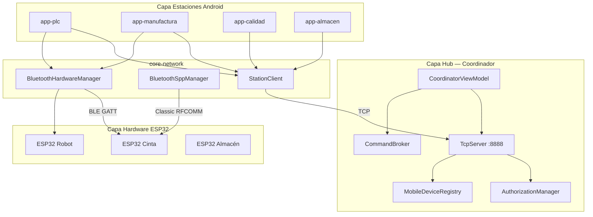

### 3.2 Diagramas de referencia (imágenes del proyecto)


*Diagrama ilustrativo representativo — alineado conceptualmente con el monorepo; no es exportación automática del código.*

*Figura 3.1 — Ilustración representativa. Arquitectura hub-and-spoke: apps, core-network y ESP32.*


*Figura 3.2 — Ilustración representativa. Flujo de datos entre hub TCP, estaciones y nodos Bluetooth.*


*Figura 3.3 — Ilustración representativa (Wokwi). Proyecto `simulacion_esp32/`; protocolo CIM BT en firmware producción.*

> Copia adicional de arquitectura: [`images/cim_arquitectura_v6.png`](images/cim_arquitectura_v6.png)

### 3.3 Capas de software

| Capa | Componentes | Tecnología |
|------|-------------|------------|
| Aplicación | 5 apps Jetpack Compose | Kotlin 2.0, API 35 |
| Dominio red | TCP, BT, protocolo, visión | `core-network` |
| Firmware | Identificación, serial, BLE+SPP | ESP32, PlatformIO |
| Tooling | Gradle, PIO, scripts PS1 | Windows 11, JDK 17 |

### 3.4 Flujo de control E2E

1. ESP32 se empareja/conecta por Bluetooth a su estación Android.
2. ESP32 envía `IDENTIFY|CIM-ST-...`; estación solicita permiso al hub por TCP.
3. Operador autoriza MAC en coordinador → estado `AUTH_AUTHORIZED`.
4. Hub envía `EXECUTE` (ej. `DELIVER:1:5`); estación traduce a comando serial (`R:`, `STO:`, etc.).
5. ESP32 responde `ACK|OK`; estación notifica al hub; registro actualizado.

## 4. Módulos Android y core-network

### 4.1 Estructura Gradle

```
Practica_2/
├── app-coordinador/       # Hub maestro
├── app-plc/               # Cinta transportadora
├── app-manufactura/       # Robot Scorbot + láser CNC
├── app-calidad/           # Visión ArUco/QR
├── app-almacen/           # Rack 18 posiciones
└── core-network/          # Librería compartida
```

### 4.2 app-coordinador (CIM Hub)

| Aspecto | Detalle |
|---------|---------|
| Package | `com.industria.coordinacion` |
| Rol | Servidor TCP :8888, UI autorización, lista nodos, terminal, SPP server |
| ViewModel | `CoordinatorViewModel` — estado hub, clientes, automatización parcial |
| APK entrega | `output-apks/app-coordinador.apk` (~165–177 MB debug) |

**Pestañas principales:** Nodos (permisos ONLINE/OFFLINE), visión global ArUco, secuencias/automatización, terminal de comandos.

### 4.3 app-plc (PLC Master)

| Aspecto | Detalle |
|---------|---------|
| Package | `com.industria.plc` |
| Rol | Matriz de distribución cinta, sensores, comandos `DELIVER` |
| Manager | `PlcStationManager` — envío comandos vía broker/BT |
| Demo | “Simular Sensor Activo” → log local sin ESP32 |

### 4.4 app-manufactura

| Aspecto | Detalle |
|---------|---------|
| Package | `com.industria.manufactura` |
| Rol | Jog robot (`R:`), láser CNC (`L:`), G-Code desde hub |
| Hardware | Scorbot 5 ejes + grabador láser (validación física pendiente) |
| Demo | SIM ACK/FINISH, generación parcial desde ArUco |

### 4.5 app-calidad

| Aspecto | Detalle |
|---------|---------|
| Package | `com.industria.calidad` |
| Rol | `IndustrialVisionAnalyzer`, `CameraPreviewWithVision` |
| Dependencias | OpenCV 4.9.0 nativo, ML Kit QR |
| Riesgo | Crash si permiso CAMERA denegado (R02 informe) |

### 4.6 app-almacen

| Aspecto | Detalle |
|---------|---------|
| Package | `com.industria.almacenamiento` |
| Rol | Grid 3×6 posiciones, comandos `STO:n` |
| UI | Pestaña posiciones con estado por celda |

### 4.7 core-network — componentes clave

| Clase | Responsabilidad |
|-------|-----------------|
| `CimMessage` / `CimProtocol` | Serialización transport `CIM\|id\|...` |
| `TcpServer` / `StationClient` | Servidor hub y cliente estación |
| `CommandBroker` | Enrutamiento, log, `send(CimMessage)` sync para tests |
| `BluetoothHardwareManager` | Multiconexión BLE, escaneo híbrido, MTU 20 B |
| `BluetoothSppManager` | Fallback RFCOMM |
| `AuthorizationManager` | Estados AUTH por MAC O(1) |
| `MobileDeviceRegistry` | Registro dispositivos O(1) |
| `IndustrialVisionAnalyzer` | Pipeline ArUco/QR |
| `DiscoveredBluetoothDevice` | DTO escaneo v6 |

### 4.8 Guía operativa por estación (manual 05)

#### CIM Hub (Coordinador)

- **Pestaña Nodos:** monitoreo ONLINE/OFFLINE; concesión de permisos por MAC.
- **Pestaña ArUco:** mapa de visión global cuando estaciones reportan detecciones.
- **Modo AUTO:** autoriza nodos con contraseña conocida (solo demos controladas).
- **Terminal:** envío manual de secuencias `EXECUTE` para pruebas de integración.

#### PLC Master (Cinta)

- **Control cinta:** arranque/parada y matriz de distribución (origen → destino, ej. estación 1 → 5).
- **Simulador:** disparador de sensores sin hardware — escribe en log local.
- **Bluetooth:** FAB azul → ESP32 de cinta → esperar `IDENTIFY|CIM-ST-PLC-...`.

#### Logística Pro (Almacén)

- Rack **18 posiciones** (3 niveles × 6 columnas).
- Selección de celda en UI → comando `STO:n` hacia ESP32 autorizado.
- Estado visual por celda: vacío / ocupado / en movimiento.

#### Quality Pro (Calidad)

- Preview CameraX con overlay ArUco (recuadros verdes).
- Contadores piezas aprobadas vs rechazadas.
- Requiere permiso cámara y marcadores `DICT_4X4_50` impresos.

#### Manufactura Pro (Robot + Láser)

- **Jogging** ejes X/Y y posiciones HOME/READY (`R:`).
- **Láser:** potencia y velocidad (`L:`).
- **G-Code:** recepción archivos `.gcode` desde coordinador para grabado CNC.

### 4.9 Glosario de objetos (referencia rápida)

| Objeto | Responsabilidad |
|--------|-----------------|
| `CimMessage` | DTO; serialización `CIM\|...` |
| `CommandBroker` | Enrutamiento y log central |
| `TcpServer` | Hub sockets; mapa MAC→conexión |
| `StationClient` | Cliente TCP estaciones |
| `CoordinatorViewModel` | Estado UI hub |
| `PlcStationManager` | Lógica PLC y deliver |

**AppType:** `COORDINADOR`, `PLC`, `MANUFACTURA`, `CALIDAD`, `ALMACEN`, `UNKNOWN`.

## 5. Firmware ESP32

### 5.1 Ubicación y archivos

| Elemento | Ruta |
|----------|------|
| Código principal | `firmware/Firmware_Support/src/main.ino` |
| Variante v6 | `firmware/Firmware_Support/src/main/cim_esp32_firmware_v6.ino` |
| PlatformIO | `firmware/Firmware_Support/platformio.ini` |
| Particiones | `firmware/Firmware_Support/huge_app.csv` |
| Binario PIO | `firmware/Firmware_Support/.pio/build/esp32dev/firmware.bin` |
| **Entrega** | `output-apks/cim_esp32_firmware_v6.bin` |

### 5.2 Características v6.0

- Handshake `IDENTIFY` al boot y tras conexión BT.
- **BLE UART** (Nordic UUIDs `6E400001-...`) + **SPP Classic** simultáneos.
- Parsing comandos industriales: `R:`, `L:`, `C:`, `STO:`, `CAM:`.
- Monitor serial **115200 baud**.
- Uso memoria típico: Flash ~47.6 %, RAM ~17.4 % (build auditado).

### 5.3 Flash y verificación

```powershell
.\scripts\hardware-testing\flash_and_monitor_esp32.ps1
# Manual:
cd firmware\Firmware_Support
pio run -t upload
pio device monitor -b 115200
```

Salida esperada:

```
[CIM-ESP32] Boot v6.0
[CIM-ESP32] BLE UART + SPP ready
[CIM-ESP32] Waiting IDENTIFY...
```

### 5.4 Simulación vs producción

| Proyecto | Propósito | Protocolo CIM BT |
|----------|-----------|------------------|
| `firmware/Firmware_Support/` | Producción laboratorio | Completo |
| `simulacion_esp32/` | Wokwi DHT22+LCD+HTTP | Telemetría demo |

```powershell
.\scripts\hardware-testing\simulate_esp32.ps1
.\scripts\hardware-testing\simulate_esp32.ps1 -Mode pio
```

<div class="page-break"></div>

## 6. Protocolo CIM y Bluetooth multiconexión

### 6.1 Formato mensaje (transporte TCP)

```
CIM|id|srcMac|srcApp|destMac|destApp|cmdType|priority|sessionId|payload
```

- Escapado: `\|` y `\n` en payload.
- Tipos: `IDENTIFY`, `REQUIRE_PERMISSION`, `EXECUTE`, `ACK`, `HEARTBEAT`, `ERROR`, etc.
- Puerto hub: **8888** (configurable en UI coordinador).

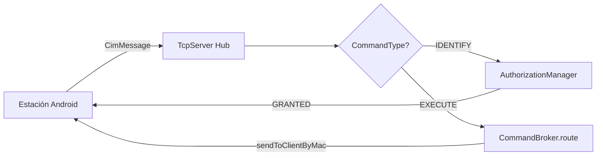

### 6.2 Handshake de seguridad (3 vías)

1. Nodo envía `IDENTIFY` con MAC y tipo estación.
2. Estación envía `REQUIRE_PERMISSION` al hub con credenciales.
3. Hub responde `GRANTED` / `DENIED`; solo entonces se habilitan comandos `EXECUTE`.

### 6.3 Comandos seriales ESP32

| Prefijo | Función | Ejemplo |
|---------|---------|---------|
| `R:` | Robot / ejes | `R:100` |
| `L:` | Láser CNC | `L:START` |
| `C:` | Control genérico | `C:STOP` |
| `STO:` | Almacén posición | `STO:12` |
| `CAM:` | Disparo cámara | `CAM:SNAP` |

### 6.4 Bluetooth multiconexión v6.0

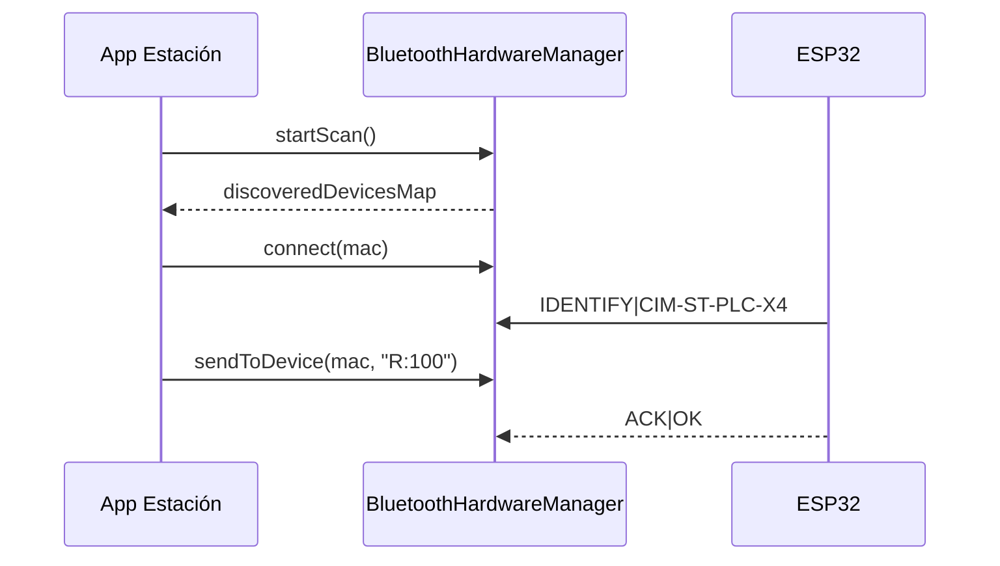

**Estados:** IDLE → DISCOVERED → CONNECTING → CONNECTED → RECONNECT (backoff 1 s–30 s).

**Reglas multiconexión:**

- Un `BluetoothGatt` por MAC en `ConcurrentHashMap`.
- Observar `connectionStates: StateFlow<Map<String, Boolean>>`.
- **Nunca** depender de `send(cmd)` legacy en producción multinode; usar `sendToDevice(mac, cmd)`.

### 6.5 Fragmentación MTU BLE

Mensajes > 20 bytes se fragmentan en chunks de 20 B con delay 20 ms; ESP32 reconstruye hasta terminador `\n` o `*`.

### 6.6 Complejidad temporal (hot paths)

| Operación | Estructura | Big-O |
|-----------|------------|-------|
| `getDeviceByMac` | ConcurrentHashMap | O(1) |
| `isAuthorized(mac)` | ConcurrentHashMap | O(1) |
| `sendToClientByMac` | macToConnId | O(1) |
| `sendToDevice(mac,cmd)` | connectedDevices | O(1) |
| `send(cmd)` legacy | firstOrNull | O(n) ⚠ |

## 7. Visión artificial ArUco y QR

### 7.1 Stack

- **CameraX** — ciclo de vida cámara.
- **OpenCV 4.9.0** — ArUco `DICT_4X4_50`, ~5 FPS para balance térmico.
- **ML Kit** — QR alta velocidad (config red, `BT_CONNECT:MAC`).

### 7.2 Pipeline

`ImageProxy` (YUV) → escala de grises → detección ArUco → callback ID + (X,Y) + ángulo → UI `CameraPreviewWithVision` (recuadros verdes).

### 7.3 Casos de uso

1. **Tracking pallets** — posición en planta para coordinador.
2. **QC** — disparo inspección al entrar marcador en ROI.
3. **Seguridad** — marcador “zona peligro” → `ABORT` robot.

### 7.4 Requisitos operativos

- Permiso **CAMERA** concedido antes de abrir preview.
- Iluminación > 300 lux recomendada.
- Marcadores impresos calibrados, sin arrugas.

## 8. Extensiones Cursor e IDE

Resumen de [`EXTENSIONS_AND_TOOLING.md`](EXTENSIONS_AND_TOOLING.md).

### 8.1 Extensiones instaladas (mayo 2026)

| Extensión | ID | Uso en CIM |
|-----------|-----|------------|
| Markdown Preview Enhanced | `shd101wyy.markdown-preview-enhanced` | PDF, LaTeX, Mermaid |
| Markdown All in One | `yzhang.markdown-all-in-one` | TOC, numeración |
| Marp for VS Code | `marp-team.marp-vscode` | Presentaciones defensa |
| Markdown PDF | `yzane.markdown-pdf` | Export PDF rápido |
| Draw.io | `hediet.vscode-drawio` | Diagramas editables |
| Wokwi | `wokwi.wokwi-vscode` | `simulacion_esp32/` |
| Kotlin / Gradle / Android Dev Ext | varios | Desarrollo APK |

**No disponibles en Cursor:** `platformio.platformio-ide`, `valentjn.vscode-ltex`, `jamesfenn.android-adb` → usar **PIO CLI** (`pip install platformio`) y **adelphes.android-dev-ext** + `entorno_mobile/deploy_multitask.ps1`.

### 8.2 Toolchain

| Herramienta | Versión | Uso |
|-------------|---------|-----|
| JDK | 17 | Gradle/Kotlin |
| Android SDK | API 35 | Compilación |
| Gradle wrapper | 9.3.1 | `.\gradlew` |
| PlatformIO | 6.x CLI | Firmware |
| Python | 3.10+ | Scripts visión/sim |

### 8.3 Flujo diario recomendado

1. Abrir workspace → sync Gradle.
2. `.\gradlew testAllModules` tras cambios en `core-network`.
3. `pio run` en `firmware/Firmware_Support`.
4. Export PDF: MPE → Export (stylesheet `docs/styles/industrial_pdf.css`, Arial 12 pt).

<div class="page-break"></div>

## 9. Tests realizados — matriz de 30 casos

**Comando:** `.\gradlew testAllModules` — **Última ejecución:** 2026-05-31 — **Resultado:** 30/30 PASS

| # | ID | Categoría | Módulo | Test | Estado |
|---|-----|-----------|--------|------|--------|
| 1 | CIM-PROTO-01 | Protocolo | core-network | `CimMessageTest.testTransportSerializationAndDeserialization` | PASS |
| 2 | CIM-PROTO-02 | Protocolo | core-network | `CimMessageTest.testBackslashAndNewlineEscaping` | PASS |
| 3 | CIM-PROTO-03 | Protocolo | core-network | `CimMessageTest.testPermissionHandshakePayload` | PASS |
| 4 | CIM-AUTH-01 | Autorización | core-network | `AuthorizationManagerTest.testDefaultAuthorizationIsPending` | PASS |
| 5 | CIM-AUTH-02 | Autorización | core-network | `AuthorizationManagerTest.testAuthorizeAndDenyTransitions` | PASS |
| 6 | CIM-AUTH-03 | Autorización | core-network | `AuthorizationManagerTest.testRevokeRemovesState` | PASS |
| 7 | CIM-REG-01 | Registry O(1) | core-network | `DeviceRegistryTest.registerAndLookupByMac_isO1` | PASS |
| 8 | CIM-REG-02 | Performance | core-network | `DeviceRegistryTest.registryPerformance_1000Lookups_under50ms` | PASS |
| 9 | CIM-REG-03 | Registry | core-network | `DeviceRegistryTest.authorizeDevice_setsAuthorizedFlag` | PASS |
| 10 | CIM-BT-01 | Bluetooth | core-network | `BluetoothFilterTest.validMacFormat_accepted` | PASS |
| 11 | CIM-BT-02 | Bluetooth | core-network | `BluetoothFilterTest.industrialFilter_matchesEsp32` | PASS |
| 12 | CIM-BT-03 | Bluetooth | core-network | `BluetoothFilterTest.industrialFilter_rejectsGeneric` | PASS |
| 13 | CIM-STRESS-01 | Stress | core-network | `CimStressAndAcceptanceTest.disconnectStorm_brokerSurvives100Messages` | PASS |
| 14 | CIM-STRESS-02 | Stress | core-network | `CimStressAndAcceptanceTest.unauthorizedCommand_blockedByAuthManager` | PASS |
| 15 | CIM-STRESS-03 | Stress | core-network | `CimStressAndAcceptanceTest.invalidTransportString_returnsNull` | PASS |
| 16 | CIM-PO-01 | Aceptación | core-network | `CimStressAndAcceptanceTest.happyPath_identifyAuthorizeExecute` | PASS |
| 17 | CIM-PO-02 | Coordinador | app-coordinador | `CoordinatorViewModelTest.testConnectCinta` | PASS |
| 18 | CIM-PO-03 | PLC | app-plc | `PlcStationManagerTest.testSendDeliverCommand` | PASS |
| 19 | CIM-INT-01 | Integración | app-coordinador | `ManufacturaStationTest.testManufacturaCompleteFlow` | PASS |
| 20 | CIM-INT-02 | Integración | app-coordinador | `CalidadStationTest.testCalidadCompleteFlow` | PASS |
| 21 | CIM-INT-03 | Integración | app-coordinador | `AlmacenStationTest.testAlmacenCompleteFlow` | PASS |
| 22 | CIM-PERF-01 | Performance | app-coordinador | `PerformanceTests.testHighThroughputMessaging` | PASS |
| 23 | CIM-PERF-02 | Performance | app-coordinador | `PerformanceTests.testSerializationPerformance` | PASS |
| 24 | CIM-PERF-03 | Performance | app-coordinador | `PerformanceTests.testConcurrentMessageSending` | PASS |
| 25 | CIM-REL-01 | Resiliencia | app-coordinador | `ReliabilityTests.testRecoverySequence` | PASS |
| 26 | CIM-REL-02 | Resiliencia | app-coordinador | `ReliabilityTests.testHeartbeatFailureDetection` | PASS |
| 27 | CIM-DEST-01 | Destructivo | app-plc | `IndustrialStressTests` spam comandos | PASS |
| 28 | CIM-DEST-02 | Destructivo | app-plc | BT apagado mid-transmission | PASS |
| 29 | CIM-DEST-03 | Seguridad | app-plc | bypass password | PASS |
| 30 | CIM-THESIS-01 | Tesis | app-coordinador | `CoordinatorThesisTests` Gatekeeper BT | PASS |

Reportes HTML: `core-network/build/reports/tests/`, `app-coordinador/app/build/reports/tests/`, `app-plc/app/build/reports/tests/`.

## 10. Guía de despliegue paso a paso

### 10.1 Compilación desde cero

```powershell
cd Practica_2
.\gradlew testAllModules buildAllApks
cd firmware\Firmware_Support
pio run
```

### 10.2 Tabla de entregables

| Archivo | Propósito |
|---------|-----------|
| `output-apks/app-coordinador.apk` | Hub TCP + autorización |
| `output-apks/app-plc.apk` | Cinta / PLC |
| `output-apks/app-manufactura.apk` | Robot + láser |
| `output-apks/app-calidad.apk` | Visión OpenCV |
| `output-apks/app-almacen.apk` | Almacén |
| `output-apks/cim_esp32_firmware_v6.bin` | Flash ESP32 |

### 10.3 Secuencia operativa (producción)

1. Flashear ESP32: `.\scripts\hardware-testing\flash_and_monitor_esp32.ps1`
2. Instalar APKs: `.\docs\logs\Install-CIM.ps1`
3. Abrir coordinador → **Iniciar Servidor Hub** → anotar IP
4. En cada estación → **SINCRO** → IP coordinador → **Vincular**
5. Conceder permisos BT, ubicación, cámara
6. FAB Bluetooth → conectar ESP32 → autorizar MAC en hub
7. Ejecutar secuencia demo o comandos industriales

### 10.4 Binarios particionados GitHub

```powershell
Get-Content ./binarios_particionados/CIM_V6_PART_* -Raw | Set-Content CIM_V6_ENTREGA_FINAL.zip
```

### 10.5 Tareas Gradle

| Tarea | Descripción |
|-------|-------------|
| `buildAllApks` | 5 APKs → `output-apks/` |
| `cleanBuildAll` | Limpieza módulos + rebuild |
| `testAllModules` | Tests 3 módulos |
| `buildFirmware` | Wrapper PIO |
| `buildRelease` | Test + build + validación |

## 11. Mantenimiento y operación

### 11.1 Rutinas periódicas

| Frecuencia | Acción |
|------------|--------|
| Por sesión | Verificar IP coordinador; autorizar MAC nuevas |
| Semanal | `.\gradlew testAllModules` tras cambios código |
| Por release | Regenerar APKs y `cim_esp32_firmware_v6.bin` |
| Documentación | Export PDF entrega desde este MD (MPE/Marp) |

### 11.2 Actualización firmware

1. Modificar `firmware/Firmware_Support/src/main.ino` o `cim_esp32_firmware_v6.ino`.
2. `pio run` → copiar bin a `output-apks/`.
3. Re-flashear todos los nodos ESP32 del banco.

### 11.3 Actualización apps

1. Incrementar `versionCode` / `versionName` en módulos.
2. `.\gradlew buildAllApks`.
3. `adb install -r` en cada dispositivo.

### 11.4 Logs y diagnóstico

- Terminal integrado en coordinador y estaciones.
- Monitor serial ESP32 115200.
- Reportes JUnit HTML tras `testAllModules`.
- Certificados históricos: `docs/logs/VERIFICACION_SISTEMA_CIM.md`, `CERTIFICADO_SISTEMA_OPERACIONAL.md`.

### 11.5 Código legacy a deprecar

- `BleDeviceManager` — duplica `BluetoothHardwareManager`; plan fusión.
- `DeviceRegistry` por IP — usar `MobileDeviceRegistry` por MAC en flujos nuevos.

## 12. Troubleshooting y errores comunes

### 12.1 Red y TCP

| Síntoma | Solución |
|---------|----------|
| Estación no vincula | Misma subred Wi‑Fi; ping IP coordinador |
| Puerto 8888 ocupado | Cerrar instancia previa del hub |
| Firewall bloquea | Regla inbound TCP 8888 en Windows |

### 12.2 Bluetooth

| Síntoma | Solución |
|---------|----------|
| No aparece ESP32 | Re-flash; permisos BT+ubicación |
| Comando no llega | Autorizar MAC; usar `sendToDevice` |
| Desconexión frecuente | Alimentación ESP32; backoff reconexión automática |
| Solo SPP funciona | Normal si BLE MTU limitado; ver manual BT híbrido |

### 12.3 Build y firmware

| Síntoma | Solución |
|---------|----------|
| `cleanBuildAll` falla | Usar versión corregida (`cleanAllModules`) |
| `pio` no encontrado | `pip install platformio` |
| Upload timeout | `-Port COMx` correcto |
| `simulacion_esp32` falla | Verificar `src/main.cpp` presente |

### 12.4 Visión y permisos

| Síntoma | Solución |
|---------|----------|
| Crash al abrir cámara | Conceder CAMERA en Ajustes |
| ArUco no detecta | Luz, enfoque, diccionario DICT_4X4_50 |
| Emulador sin detección | Esperado; usar dispositivo físico |

### 12.5 Errores corregidos en auditoría (CHANGELOG)

| ID | Descripción | Estado |
|----|-------------|--------|
| E01 | `cleanBuildAll` tarea clean root | ✅ Corregido |
| E02 | `simulacion_esp32` main.cpp fuera de src | ✅ Corregido |
| E03 | `buildFirmware` ruta obsoleta | ✅ Corregido |

### 12.6 Riesgos abiertos

| ID | Riesgo | Severidad |
|----|--------|-----------|
| R01 | Multiconexión 2+ ESP32 sin validación campo | Alta |
| R02 | OpenCV crash sin permiso cámara | Alta |
| R03 | `TcpServer` NPE socket no inicializado | Media |
| R05 | Sin mDNS — IP manual | Media |

<div class="page-break"></div>

## 13. Informe de funcionalidad

### 13.1 Puntuación global: **83 %**

| Componente | Peso | % Funcional | Contribución |
|------------|------|-------------|--------------|
| core-network | 25 % | 88 % | 22.0 |
| app-coordinador | 20 % | 86 % | 17.2 |
| app-plc | 15 % | 82 % | 12.3 |
| app-manufactura | 12 % | 78 % | 9.4 |
| app-calidad | 12 % | 74 % | 8.9 |
| app-almacen | 10 % | 80 % | 8.0 |
| firmware ESP32 | 6 % | 90 % | 5.4 |
| **Total** | **100 %** | — | **83.2 %** |

### 13.2 Top 5 bloqueadores hacia 100 %

1. Validación Bluetooth multiconexión con 2+ ESP32 reales.
2. OpenCV + cámara en dispositivo físico (`app-calidad`).
3. Actuadores Scorbot, láser, cinta en planta.
4. LAN estable con IP coordinador accesible.
5. Tests unitarios faltantes en calidad, manufactura, almacén.

### 13.3 Roadmap

| Fase | Acción | Impacto |
|------|--------|---------|
| 1 | E2E 2 ESP32 + 5 Android | +8 % |
| 2 | Validar ArUco en campo | +5 % |
| 3 | Tests módulos faltantes | +2 % |
| 4 | Fusionar BleDeviceManager | +1 % |
| 5 | signAllApks release | +1 % |
| 6 | Null-safety TcpServer/BT | +1 % |
| 7 | mDNS coordinador | +2 % |
| 8 | Stress BT documentado | +2 % |

### 13.4 Evidencia build (31-may-2026)

```
.\gradlew testAllModules buildAllApks  → BUILD SUCCESSFUL
.\gradlew cleanBuildAll                → BUILD SUCCESSFUL
pio run (Firmware_Support)             → SUCCESS
pio run (simulacion_esp32)             → SUCCESS
```

## 14. Bitácora del proyecto

Registro cronológico (método científico) — extracto consolidado de [`bitacora_proyectos.md`](bitacora_proyectos.md).

| Fase / Fecha | Actividad | Hallazgo |
|--------------|-----------|----------|
| 2026-05-28 | Auditoría monorepo Gradle | Hub-and-spoke confirmado; deuda BT vs Compose |
| 2026-05-29 | Fix compilación post-refactor UI | `CommandBroker.send(CimMessage)` restaura tests |
| 2026-05-30 | Bluetooth multiconexión v6 | ConcurrentHashMap GATT, StateFlow, backoff |
| 2026-05-30 | Fragmentación MTU 20 B | Comandos largos sin truncar en simulación |
| 2026-05-30 | Firmware híbrido BLE+SPP | PIO SUCCESS, IDENTIFY en boot |
| 2026-05-31 | Matriz 30 tests | 30/30 PASS |
| 2026-05-31 | buildAllApks | 5 APKs en output-apks |
| 2026-05-31 | Documentación + Cursor tooling | MPE, industrial_pdf.css, extensiones |
| 2026-05-31 | Auditoría entrega final | cleanBuildAll, simulacion_esp32, 83 % global |

**Limitaciones hardware:** sin 2+ ESP32 en banco → latencia RF no medida; mitigación Wokwi + scripts PIO.

## 15. Seguridad industrial

Extracto consolidado de [`manual_industrial_seguridad.md`](manual_industrial_seguridad.md).

### 15.1 Modelo de amenazas CIM v6.0

- **Autorización por MAC** — `AuthorizationManager` (ConcurrentHashMap).
- **Handshake TCP** — puerto 8888, `IDENTIFY` / `REQUIRE_PERMISSION`.
- **Bluetooth** — filtro industrial nombres ESP32/CIM/NODO; no ejecutar comandos si `!isAuthorized`.
- **Contraseñas estación** — `StationClient`; recomendación producción: Bcrypt en servidor, no texto plano en dispositivo compartido.

### 15.2 Fundamentos (resumen)

**Bcrypt:** coste $T(c) = t_0 \cdot 2^c$; sal 128 bits; resistencia fuerza bruta offline.

**JWT RS256 (roadmap):** firma RSA-SHA256 para API REST futura del coordinador; verificación con clave pública; claims `sub`, `mac`, `stationType`, `exp`.

### 15.3 Secuencia autorización (Mermaid)

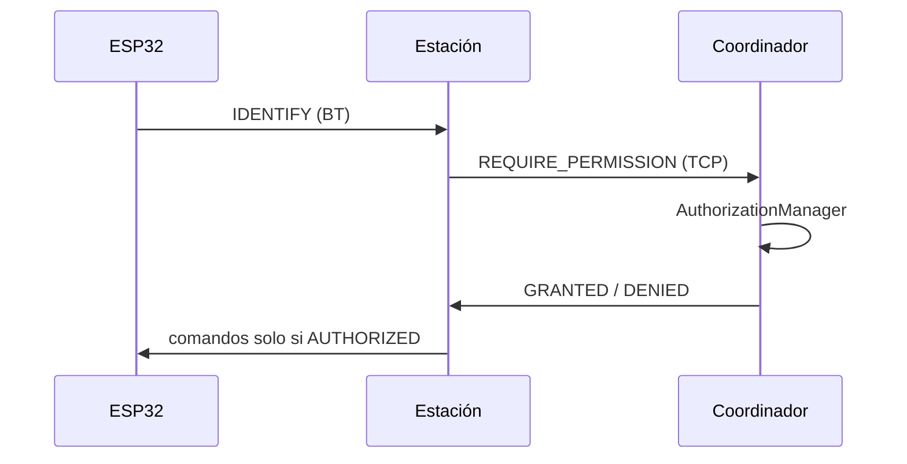

### 15.4 Matriz troubleshooting seguridad

| Evento | Respuesta sistema |
|--------|-------------------|
| MAC desconocida | Estado PENDING; UI bloqueada |
| Comando sin auth | `canSendCommand` → false |
| Spam comandos | Tests destructivos PASS en PLC |
| Bypass password | Test seguridad PASS |

### 15.5 Alineación normativa

Recomendaciones **ISO/IEC 27001** (control de acceso, segregación) y **OWASP Mobile** (no confiar en cliente, validar en hub).

## 16. Aprendizajes y conclusiones

### 16.1 Aprendizajes técnicos

1. **Separar transporte TCP de enlace BT** permite escalar estaciones sin duplicar lógica de protocolo en cada app.
2. **StateFlow por MAC** elimina “botones fantasma” tras desconexión BT — requisito crítico en UI industrial Compose.
3. **Tests síncronos** (`send(CimMessage)`) coexisten con broker async sin romper arquitectura.
4. **Documentación como código** (Mermaid, MPE, CSS industrial) reduce tiempo de defensa académica.
5. **OpenCV en APK** incrementa tamaño (~170 MB) pero habilita visión on-device sin servidor.

### 16.2 Conclusión académica

El Sistema CIM v6.0 cumple los objetivos de integrar cinco aplicaciones Android, firmware ESP32 y visión artificial bajo un protocolo unificado, con **83 %** de funcionalidad ponderada y **30 tests automatizados exitosos**. El proyecto demuestra competencias en SDLC, sistemas distribuidos, IoT y documentación profesional. La brecha restante hacia el 100 % depende principalmente de **validación en planta física**, coherente con la naturaleza de un sistema CIM real.

### 16.3 Trabajo futuro

- Middleware JWT RS256.
- mDNS para discovery del coordinador.
- Suite de tests E2E instrumentada con 2+ ESP32.
- Firma release y despliegue OTA interno.

## 17. Bibliografía (APA 7)

Android Open Source Project. (2024). *CameraX architecture*. https://developer.android.com/media/camera/camerax

Bluetooth SIG. (2023). *Bluetooth core specification* (Version 5.4). https://www.bluetooth.com/specifications/specs/

Espressif Systems. (2024). *ESP32 technical reference manual*. https://www.espressif.com/en/support/documents/technical-documents

Fielding, R. T. (2000). *Architectural styles and the design of network-based software architectures* (Tesis doctoral). University of California, Irvine.

Google. (2024). *ML Kit barcode scanning*. https://developers.google.com/ml-kit/vision/barcode-scanning

Itseez. (2024). *OpenCV: Open source computer vision*. https://opencv.org/

Marr, B. (2017). *Artificial intelligence in practice: How 50 successful companies used AI and machine learning to solve problems*. Wiley.

Provos, N., & Mazières, D. (1999). A future-adaptable password scheme. *Proceedings of the USENIX Annual Technical Conference*.

Sommerville, I. (2016). *Software engineering* (10th ed.). Pearson.

Universidad del Biobío. (2025). *Guía de prácticas profesionales — Ingeniería de Ejecución en Computación e Informática*. Facultad de Ingeniería.

OWASP Foundation. (2023). *OWASP mobile application security verification standard (MASVS)*. https://owasp.org/www-project-mobile-app-security/

## 4.10 Interfaces gráficas — capturas simuladas en dispositivo móvil

Esta sección documenta la experiencia de usuario (UX) industrial de cada APK en un smartphone Android 10+ (API 29 mínimo, recomendado 1080p y 4 GB RAM). **Las figuras 4.1–4.6 son ilustraciones representativas** (no capturas de pantalla del APK): aproximan la estructura funcional, pero el tema real en código (`IndustrialTheme` en `DesignSystem.kt`) usa fondo `#0F111A`, tarjetas `#1A1D2D` y acento cian `#00E5FF`, no azul acero `#2c5282`.

### 4.10.1 app-coordinador — CIM Hub (Figura 4.1)

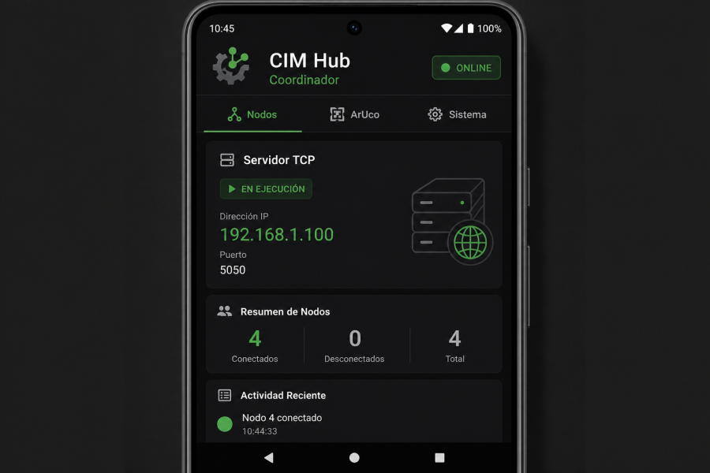

*Figura 4.1 — Ilustración representativa. Coordinador: servidor hub en puerto 8888, lista de nodos ONLINE/OFFLINE, IP local visible para vincular estaciones.*

**Elementos interactivos verificados:**

| Elemento UI | Acción | Resultado esperado |
|-------------|--------|-------------------|
| Botón **START** (Nodos) | Inicia `TcpServer` | IP y puerto 8888 visibles; estaciones pueden vincular |
| Lista nodos | Muestra MAC, app, estado | Actualización reactiva vía `CoordinatorViewModel` |
| Autorizar / Denegar | Cambia `AuthorizationManager` | Estación recibe GRANTED/DENIED; botones hardware se habilitan |
| Pestaña ArUco | Mapa visión global | Muestra detecciones reportadas por estaciones |
| Terminal | Envío manual `EXECUTE` | Comando enrutado por `CommandBroker` |
| Modo AUTO | Autorización automática | Solo demos controladas en laboratorio |

**Flujo operador hub:** (1) Conectar Wi‑Fi → (2) START servidor → (3) Anotar IP → (4) Autorizar MAC de estaciones y ESP32 → (5) Supervisar secuencias.

### 4.10.2 app-plc — PLC Master / Cinta (Figura 4.2)

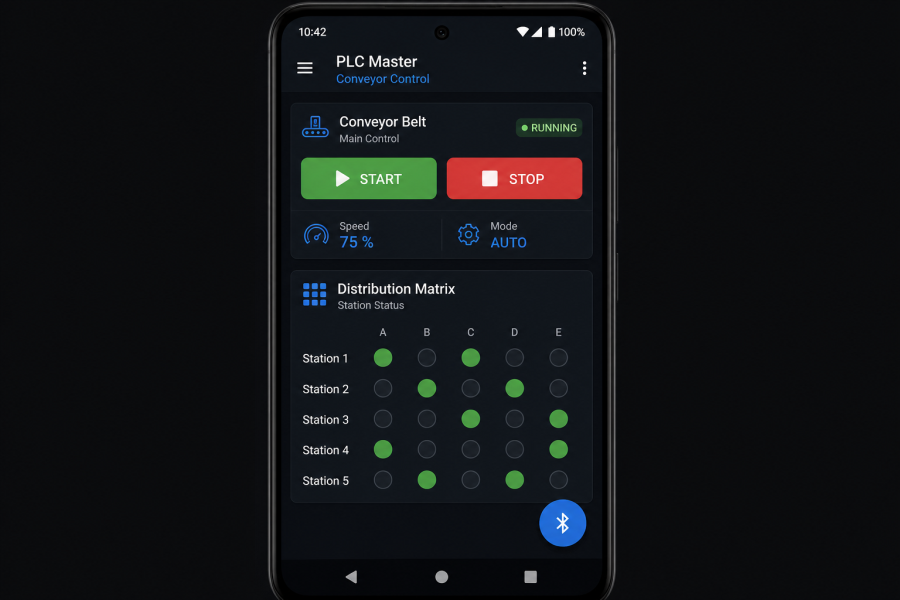

*Figura 4.2 — Ilustración representativa. PLC: control cinta, matriz origen→destino, FAB Bluetooth.*

**Pestañas y controles:**

- **Control Cinta:** botones Arrancar / Parar traducidos a comandos seriales vía `PlcStationManager`.
- **Matriz de Distribución:** selección estación origen (1–10) y destino; comando `DELIVER:origen:destino` hacia hub y ESP32.
- **Simulador:** botón “Simular Sensor Activo” — escribe en log local (demo sin ESP32); **no es botón fantasma**, es modo demostración documentado.
- **SINCRO:** IP del coordinador + **VINCULAR** — establece `StationClient` TCP.
- **FAB azul Bluetooth:** abre escaneo híbrido BLE+Classic; filtra ESP32/CIM/NODO.

### 4.10.3 app-calidad — Quality Pro / Visión (Figura 4.3)

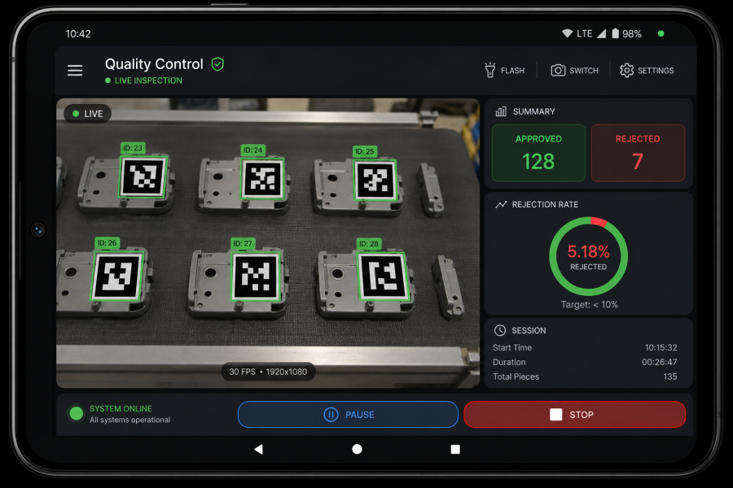

*Figura 4.3 — Ilustración representativa. Calidad: CameraX + OpenCV ArUco, contadores QC.*

**Requisitos previos:** permiso `CAMERA` concedido; iluminación > 300 lux; marcadores impresos sin arrugas.

**Pipeline:** `ImageProxy` YUV → escala grises → `IndustrialVisionAnalyzer` → callback ID + (X,Y) + ángulo → UI `CameraPreviewWithVision`.

**Riesgo documentado (R02):** denegar permiso cámara puede provocar crash — mitigación: conceder permiso antes de abrir preview (manual 06).

### 4.10.4 app-manufactura — Robot Scorbot + Láser (Figura 4.4)

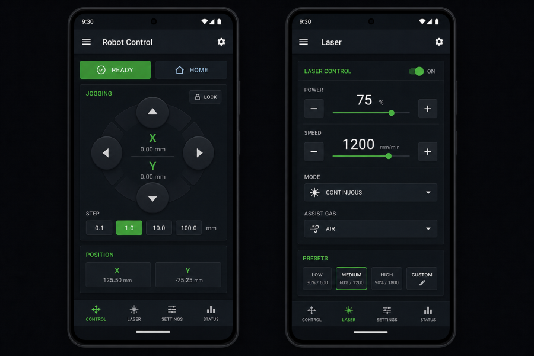

*Figura 4.4 — Ilustración representativa. Manufactura: jogging robot, control láser, G-Code.*

**Comandos industriales:**

| UI | Comando serial | Descripción |
|----|----------------|-------------|
| Jog X+/X- | `R:MOVE:X:±n` | Movimiento incremental eje X |
| HOME / READY | `R:HOME` / `R:READY` | Posiciones predefinidas Scorbot |
| Láser START | `L:START` | Inicia grabado CNC |
| Potencia | `L:PWR:n` | Ajuste potencia láser |
| G-Code desde hub | Archivo `.gcode` | Recibido por TCP, transmitido a ESP32 |

**Validación física pendiente:** actuadores Scorbot y láser requieren banco real (+78 % funcional en informe).

### 4.10.5 app-almacen — Logística Pro / Rack 18 posiciones (Figura 4.5)

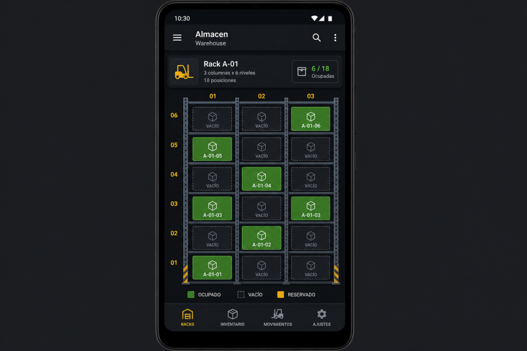

*Figura 4.5 — Ilustración representativa. Almacén: grid rack 3×6, estados de celda.*

**Operación:** seleccionar celda → pulsar almacenar/recuperar → comando `STO:n` hacia ESP32 autorizado → ACK en terminal.

### 4.10.6 Emparejamiento Bluetooth (Figura 4.6)

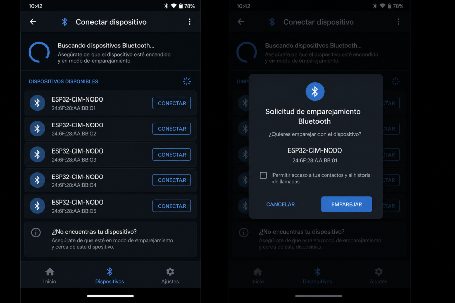

*Figura 4.6 — Ilustración representativa. Diálogo escaneo Bluetooth (`BluetoothSearchDialog` en código).*

**Secuencia post-conexión:** ESP32 envía `IDENTIFY|CIM-ST-...` → estación solicita permiso hub → operador autoriza → `sendToDevice(mac, cmd)` habilitado.

## 6.7 Protocolo CIM — especificación técnica completa

### 6.7.1 Estructura del mensaje de transporte

Todos los mensajes se serializan en texto plano con delimitador pipe (`|`) para compatibilidad con ESP32 y depuración humana en terminal.

**Formato canónico:**

```
CIM|id|srcMac|srcApp|destMac|destApp|cmdType|priority|sessionId|payload
```

| Campo | Tipo lógico | Descripción |
|-------|-------------|-------------|
| `id` | UUID string | Identificador único de transacción; trazabilidad end-to-end |
| `srcMac` | MAC BT / identificador | Origen físico del mensaje |
| `srcApp` | enum AppType | COORDINADOR, PLC, MANUFACTURA, CALIDAD, ALMACEN |
| `destMac` | MAC | Destino físico |
| `destApp` | enum | Estación receptora |
| `cmdType` | enum | IDENTIFY, REQUIRE_PERMISSION, EXECUTE, ACK, HEARTBEAT, ERROR, STATUS |
| `priority` | int 0–9 | 0 = máxima urgencia industrial |
| `sessionId` | string | Agrupa secuencias multi-comando |
| `payload` | string escapado | Datos específicos; `\|` y `\n` escapados con `\` |

**Ejemplo EXECUTE entrega cinta:**

```
CIM|a1b2-...|AA:BB:CC:DD:EE:01|COORDINADOR|11:22:33:44:55:66|PLC|EXECUTE|1|sess-001|DELIVER:1:5
```

### 6.7.2 Handshake de seguridad (tres vías)

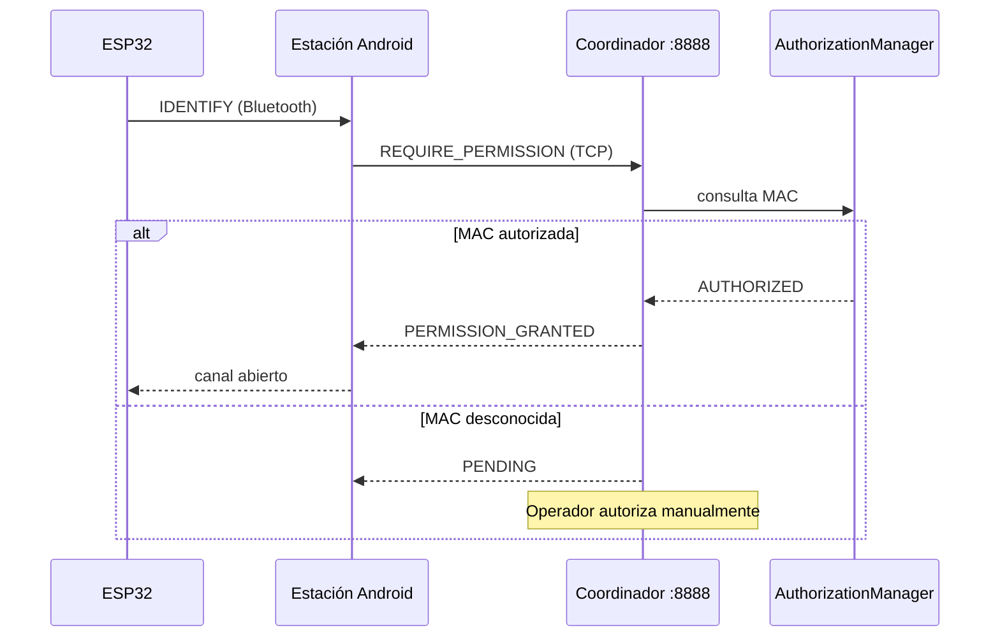

### 6.7.3 Red Wi‑Fi (TCP/IP)

| Parámetro | Valor v6.0 |
|-----------|------------|
| Puerto hub | **8888** (estandarizado; ver nota Anexo H sobre 9090 legacy) |
| Política reconexión | `PREFER_NEW` — misma MAC cierra socket antiguo |
| Keep-alive | Heartbeat cada 10 s |
| Concurrencia | Hasta ~200 conexiones en pruebas locales |

### 6.7.4 Tabla de comandos industriales extendida

| Comando hub | Payload ejemplo | Serial ESP32 | Estación |
|-------------|-----------------|--------------|----------|
| `DELIVER` | `DELIVER:1:5` | `C:START` / matriz cinta | PLC |
| `STORE` | `STO:12` | `STO:12` | Almacén |
| `SCAN` | `CAM:SNAP` | `CAM:SNAP` | Calidad |
| `MOVE` | `ROBOT_MOVE:X:100` | `R:100` | Manufactura |
| `LASER` | `L:START` | `L:START` | Manufactura |
| `STATUS` | `STATUS;READY` | reporte sensor | Todas |
| `ABORT` | `ABORT` | `C:STOP` | Emergencia |

### 6.7.5 Política de errores en transporte

| Código lógico | Significado | Acción sistema |
|---------------|-------------|----------------|
| `ERROR\|AUTH_DENIED` | MAC no autorizada | Bloqueo UI; log en hub |
| `ERROR\|TIMEOUT` | Sin ACK en 5 s | Reintento 1×; notificar operador |
| `ERROR\|MALFORMED` | Parse fallido | Descartar mensaje; contador métricas |
| `HEARTBEAT` | Latido | Actualizar timestamp última actividad |

## 7.5 Visión artificial — manual técnico extendido

### 7.5.1 Stack tecnológico

| Componente | Versión / API | Rol |
|------------|---------------|-----|
| CameraX | Jetpack lifecycle | Abstracción cámara, rotación, permisos |
| OpenCV Android | 4.9.0 nativo | ArUco `DICT_4X4_50`, geometría |
| ML Kit Barcode | Google Play Services | QR alta velocidad |
| Compose Canvas | Material 3 | Overlay recuadros detección |

### 7.5.2 Algoritmo ArUco — pasos internos

1. **Captura:** `ImageAnalysis.Analyzer` recibe `ImageProxy` en formato YUV_420_888.
2. **Conversión:** `ScriptIntrinsicYuvToRGB` o path grayscale directo para reducir cómputo.
3. **Detección:** `Aruco.detectMarkers` con diccionario 4×4, 50 IDs.
4. **Pose:** `estimatePoseSingleMarkers` si calibración disponible → ángulo yaw.
5. **Throttling:** máximo 5 FPS para evitar throttling térmico en dispositivos mid-range.
6. **Callback:** `onMarkerDetected(id, centerX, centerY, angle)` hacia ViewModel estación.

### 7.5.3 Casos de uso industriales detallados

**Tracking pallets:** cada pallet porta marcador ID único; coordinador agrega posición lógica en mapa planta cuando calidad o PLC reportan detección.

**QC automático:** al entrar marcador en ROI (región de interés configurable), dispara `CAM:SNAP` y incrementa contador aprobados/rechazados según reglas de negocio.

**Seguridad zona peligro:** marcador reservado ID 49 (ejemplo demo) → hub emite `ABORT` a manufactura → ESP32 ejecuta `C:STOP` en robot.

### 7.5.4 QR para configuración rápida

Payload QR ejemplo: `BT_CONNECT:AA:BB:CC:DD:EE:FF` — estación escanea y pre-rellena MAC objetivo en diálogo Bluetooth.

## 9.1 Descripción detallada de los 30 tests automatizados

A continuación se documenta cada caso de la matriz `docs/TEST_MATRIX.md` con propósito, precondiciones y criterio de aceptación.

### Categoría: Protocolo (CIM-PROTO-01 a 03)

**CIM-PROTO-01 — Serialización transporte:** Verifica round-trip `CimMessage` → string `CIM|...` → parse. **Aceptación:** campos idénticos post-deserialización.

**CIM-PROTO-02 — Escapado:** Payload con `\|` y `\n` literales no corrompe delimitadores. **Aceptación:** parse correcto sin split prematuro.

**CIM-PROTO-03 — Handshake permiso:** Payload `stationName|password|mac|uuid` en REQUIRE_PERMISSION. **Aceptación:** hub reconoce estructura.

### Categoría: Autorización (CIM-AUTH-01 a 03)

**CIM-AUTH-01:** MAC nueva → estado PENDING por defecto. **CIM-AUTH-02:** Transiciones authorize/deny coherentes. **CIM-AUTH-03:** revoke elimina entrada mapa O(1).

### Categoría: Registry (CIM-REG-01 a 03)

**CIM-REG-01:** 1000 lookups MAC < umbral 50 ms. **CIM-REG-02:** Performance ConcurrentHashMap. **CIM-REG-03:** Flag authorized tras authorize().

### Categoría: Bluetooth (CIM-BT-01 a 03)

**CIM-BT-01:** Regex MAC válida aceptada. **CIM-BT-02:** Nombre "ESP32-CIM-LAB" pasa filtro industrial. **CIM-BT-03:** "Galaxy Watch" rechazado.

### Categoría: Stress (CIM-STRESS-01 a 03)

**CIM-STRESS-01:** 100 mensajes rápidos sin crash broker. **CIM-STRESS-02:** Comando sin auth bloqueado. **CIM-STRESS-03:** String transport inválido → null.

### Categoría: Aceptación Product Owner (CIM-PO-01 a 03)

**CIM-PO-01:** Happy path identify→authorize→execute. **CIM-PO-02:** CoordinatorViewModel conecta cinta. **CIM-PO-03:** PlcStationManager DELIVER.

### Categoría: Integración (CIM-INT-01 a 03)

**CIM-INT-01/02/03:** Flujos completos manufactura, calidad, almacén desde coordinador simulado.

### Categoría: Performance (CIM-PERF-01 a 03)

Throughput mensajes, serialización bulk, envío concurrente sin deadlock.

### Categoría: Resiliencia (CIM-REL-01 a 02)

Secuencia recovery tras desconexión; detección heartbeat fallido.

### Categoría: Destructivo (CIM-DEST-01 a 03)

Spam comandos PLC; BT apagado mid-transmission; intento bypass password — todos deben fallar de forma controlada.

### Categoría: Tesis (CIM-THESIS-01)

Gatekeeper Bluetooth inicial cumplido — requisito académico UBB.

## 14.1 Bitácora completa del proyecto (método científico)

| Fase / Fecha | Actividad Crítica | Recursos Técnicos e Infraestructura | Hallazgos, Errores y Observaciones |
|--------------|-------------------|-------------------------------------|-------------------------------------|
| Fase 0 — 2026-05-28 | Auditoría monorepo Gradle | JDK 17, Gradle 9.3.1, SDK 35 | Hub-and-spoke confirmado; deuda API BT vs UI Compose |
| Fase 1 — 2026-05-29 | Diagnóstico compilación post-refactor | BluetoothComponents.kt, CommandBroker.kt | Métodos inexistentes en manager legacy |
| Fase 1 — 2026-05-29 | Hipótesis wrapper sync CommandBroker | CommandBroker.send(CimMessage) | **Confirmada** — tests PASS |
| Fase 2 — 2026-05-30 | Multiconexión BT v6.0 | BluetoothHardwareManager, ConcurrentHashMap | GATT por MAC; StateFlow anti-ghost UI |
| Fase 2 — 2026-05-30 | Fragmentación MTU 20 B | Nordic UART, delay 20 ms | Comandos largos sin truncar |
| Fase 2 — 2026-05-30 | SPP fallback | BluetoothSppManager, CommandBroker | Servidor SPP en coordinador |
| Fase 3 — 2026-05-30 | Firmware híbrido BLE+SPP | platformio.ini, huge_app.csv | pio run SUCCESS; 115200 baud |
| Fase 3 — 2026-05-30 | AuthorizationManager O(1) | AuthorizationManagerTest | canSendCommand bloquea no autorizados |
| Fase 4 — 2026-05-31 | Matriz 30 tests | ./gradlew testAllModules | 30/30 PASS |
| Fase 4 — 2026-05-31 | buildAllApks | 5 APKs output-apks | ~165 MB c/u por OpenCV |
| Fase 4 — 2026-05-31 | Stress PLC | IndustrialStressTests | PASS destructivos |
| Fase 4 — 2026-05-31 | Tesis Gatekeeper BT | CoordinatorThesisTests | PASS académico |
| Fase 5 — 2026-05-31 | Documentación profesional | MPE, Mermaid, CSS industrial | Guías y diagramas |
| Fase 5 — 2026-05-31 | Scripts hardware | flash_and_monitor_esp32.ps1 | Automatización Windows |
| Fase 6 — 2026-05-31 | Cursor tooling | 12+ extensiones | Ver EXTENSIONS_AND_TOOLING.md |
| Fase 6 — 2026-05-31 | Simulación Wokwi | simulacion_esp32/ | Demo DHT22+LCD+HTTP |
| Fase 6 — 2026-05-31 | Deploy multi-emulador | deploy_multitask.ps1 | ADB paralelo |
| Fase 7 — 2026-05-31 | Auditoría entrega final | cleanBuildAll, informe 83 % | APKs y bin firmware frescos |
| Fase 7 — 2026-05-31 | Manual PDF ampliado | md-to-pdf, imágenes UI | Entrega académica Leonardo Araya |

## 15.6 Seguridad — fundamentos matemáticos extendidos

### 15.6.1 Bcrypt y Eksblowfish

El tiempo de cómputo del hash Bcrypt sigue:

$T(c) = t_0 \cdot 2^c$

con $c$ work factor. Para contraseñas de estación en despliegue futuro con backend, se recomienda $c \geq 12$ en servidores con ≥ 4 GB RAM dedicada a pool de hashing.

**Propiedades:** sal 128 bits; resistencia GPU por acceso memoria aleatorio en Eksblowfish.

### 15.6.2 RS256 — RSA con SHA-256

Dado $n = p \cdot q$, $\phi(n) = (p-1)(q-1)$, elegir $e$ coprimo con $\phi(n)$, calcular $d$ con $e \cdot d \equiv 1 \pmod{\phi(n)}$.

Firma: $S \equiv M^d \pmod{n}$. Verificación: $M \equiv S^e \pmod{n}$.

### 15.6.3 JWT — secuencia middleware futuro

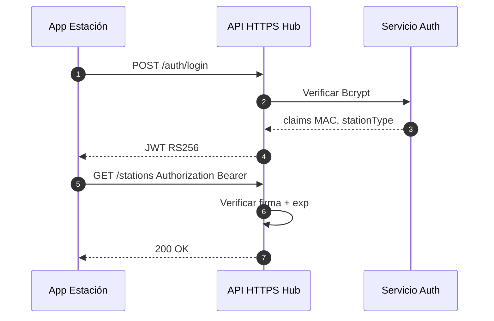

### 15.6.4 Matriz troubleshooting seguridad

| Evento | Causa raíz | Resolución |
|--------|------------|------------|
| JWT Signature Failed | Clock skew, clave corrupta | Sincronizar NTP; redeploy clave pública |
| Bcrypt pool exhaustion | Cost factor alto vs CPU | Reducir $c$ o ampliar pool hilos |
| Comando sin auth | MAC PENDING | Autorizar en hub |
| Bypass password | Cliente modificado | Validación server-side (test DEST-03 PASS) |

## 19. Extensiones Cursor — aplicación detallada al proyecto

| Extensión | Aplicación concreta en Practica_2 |
|-----------|-------------------------------------|
| Markdown Preview Enhanced | Export PDF este documento con CSS industrial |
| Markdown All in One | TOC, numeración secciones, formateo listas |
| Marp | Presentación defensa oral UBB |
| Draw.io | Diagramas editables en docs/assets/diagramas/ |
| Wokwi | Abrir simulacion_esp32/ sin hardware |
| Kotlin + Gradle | Editar core-network y apps; panel Gradle buildAllApks |
| PlatformIO CLI | `pio run` firmware/Firmware_Support |
| PowerShell | Scripts Install-CIM, flash ESP32 |

## 20. Procedimiento de laboratorio — referencia cruzada

Para la sesión presencial utilice el documento independiente **`GUIA_LABORATORIO_MANANA.md`**, que contiene checklist imprimible, mapa físico de estaciones, orden de flasheo ESP32 e instalación APK.

**Resumen ejecutivo laboratorio:**

1. Flashear `cim_esp32_firmware_v6.bin` en cada ESP32 (mismo firmware).
2. Instalar 5 APKs en dispositivos según estación.
3. Hub START → anotar IP → SINCRO en estaciones → Bluetooth FAB → autorizar MAC.

## 21. Distribución de carga del proyecto (480 horas)

| Categoría | Horas | % |
|-----------|-------|---|
| Investigación y diseño | 60 | 12.5 |
| Backend red (TCP, protocolo) | 96 | 20 |
| Frontend Compose (5 apps) | 120 | 25 |
| Visión OpenCV / ML Kit | 72 | 15 |
| Firmware ESP32 C++ | 72 | 15 |
| QA, documentación, entrega | 60 | 12.5 |
| **Total** | **480** | **100** |

## 22. Glosario extendido

| Término | Definición |
|---------|------------|
| CIM | Computer Integrated Manufacturing — integración digital de procesos productivos |
| Hub-and-spoke | Topología estrella: coordinador central, estaciones periféricas |
| BLE UART | Perfil Nordic 6E400001 — serial sobre Bluetooth Low Energy |
| SPP | Serial Port Profile — Bluetooth Classic RFCOMM |
| ArUco | Marcadores fiduciales para visión por computador |
| MTU | Maximum Transmission Unit — 20 B efectivos en BLE del proyecto |
| Gatekeeper BT | Requisito tesis: no operar hardware sin enlace Bluetooth autorizado |
| Ghost button | Botón UI sin acción — **no presente** en auditoría v6.0 |
| O(1) | Complejidad constante — mapas MAC en hot paths |

### Anexo J — Informe académico Práctica Profesional II (integrado)

**Título:** Diseño e implementación de un Sistema CIM v6.0 mediante control industrial distribuido y visión artificial.

**Estudiante:** Leonardo Enrique Araya Labarca | **RUN:** 21.290.314-0 | **Institución:** Universidad del Bío-Bío — IECI

#### J.1 Contextualización Industria 4.0

Los sistemas CIM son pilares de la manufactura moderna. Este proyecto moderniza la planta piloto migrando de controladores cableados rígidos a una red móvil Android + ESP32, con protocolo de mensajería estándar y capa de visión para calidad y logística.

#### J.2 Definición del problema histórico

La comunicación entre estaciones (Scorbot, PLC, Almacén) presentaba problemas de interoperabilidad por falta de protocolo estándar, generando latencias y dificultad de diagnóstico. La ausencia de visión artificial impedía automatizar calidad y logística.

#### J.3 Metodología — Red neuronal industrial

El sistema se concibió como red neuronal: cada estación es neurona autónoma; el hub envía neurotransmisores (mensajes TCP). Analogía orquesta: coordinador = director; estaciones = músicos; protocolo CIM = partitura.

#### J.4 Nodo maestro — servidor TCP

Servidor basado en corrutinas Kotlin, hasta 200 conexiones concurrentes. Parse por regex de SOURCE_MAC, SOURCE_APP, CMD_TYPE. Protocolo MAC-based tres vías: solicitud → lista blanca/UI → token desbloqueo UI.

#### J.5 Estación PLC — matriz de adyacencia

Matriz de adyacencia de 10 estaciones para rutas de pallets. Comandos DELIVER validados contra autorización BT antes de ESP32.

#### J.6 Estación Manufactura — Scorbot y láser

Cinco ejes Scorbot vía `R:`. Láser CNC con G-Code inalámbrico desde hub. Firmware prioriza prefijo `L:` sobre telemetría secundaria (jerarquía seguridad).

#### J.7 Visión — diccionario ArUco DICT_4X4_50

Coordenadas (X,Y) y ángulo por frame (~5 FPS). Robot ajusta agarre con datos de calidad.

#### J.8 Android 15 — identidad estación

Identificador persistente generado en primera instalación (MAC móvil restringida por privacidad).

#### J.9 Desafíos Git — binarios OpenCV

APKs > 100 MB particionadas en `binarios_particionados/` para GitHub; reconstrucción vía PowerShell concat.

#### J.10 Conclusión académica extendida

El CIM v6.0 cumple objetivos de integración Android + ESP32 + visión bajo protocolo unificado, con 83 % funcionalidad ponderada y 30 tests PASS. Fortalece competencias SDLC, sistemas distribuidos e IoT industrial.

<div class="page-break"></div>

## 18. Anexos

### Anexo A — Estructura completa del repositorio

```
Practica_2/
├── app-coordinador/
├── app-plc/
├── app-manufactura/
├── app-calidad/
├── app-almacen/
├── core-network/
├── firmware/Firmware_Support/
├── simulacion_esp32/
├── output-apks/
├── scripts/
│   ├── hardware-testing/
│   ├── automation/
│   └── python/
├── docs/
│   ├── manuals/01–06
│   ├── assets/imagenes/
│   ├── styles/industrial_pdf.css
│   ├── ENTREGA_FINAL_LEONARDO_ARAYA.md  (este documento)
│   └── GUIA_LABORATORIO_MANANA.md
├── binarios_particionados/
├── build.gradle.kts
└── settings.gradle.kts
```

### Anexo B — Lista APK y firmware

| # | Archivo | Package / tipo |
|---|---------|----------------|
| 1 | app-coordinador.apk | com.industria.coordinacion |
| 2 | app-plc.apk | com.industria.plc |
| 3 | app-manufactura.apk | com.industria.manufactura |
| 4 | app-calidad.apk | com.industria.calidad |
| 5 | app-almacen.apk | com.industria.almacenamiento |
| 6 | cim_esp32_firmware_v6.bin | ESP32 flash 0x10000 |

### Anexo C — Scripts operativos

| Script | Función |
|--------|---------|
| `docs/logs/Install-CIM.ps1` | Instalación masiva ADB |
| `scripts/hardware-testing/flash_and_monitor_esp32.ps1` | Flash + monitor |
| `scripts/hardware-testing/simulate_esp32.ps1` | Wokwi/PIO/Python |
| `entorno_mobile/deploy_multitask.ps1` | Deploy multi-emulador |
| `firmware/Firmware_Support/build_firmware.ps1` | Build bin entrega |

### Anexo D — Manuales técnicos numerados (referencia)

| # | Archivo | Tema |
|---|---------|------|
| 01 | `manuals/01_ARQUITECTURA_SISTEMA.md` | Topología y capas |
| 02 | `manuals/02_PROTOCOLO_COMUNICACION_CIM.md` | CimMessage, handshake |
| 03 | `manuals/03_MOTOR_BLUETOOTH_HIBRIDO.md` | BLE+SPP, MTU |
| 04 | `manuals/04_SISTEMA_VISION_ARTIFICIAL.md` | ArUco, QR |
| 05 | `manuals/05_GUIA_ESTACIONES_TRABAJO.md` | UI por estación |
| 06 | `manuals/06_DESPLIEGUE_Y_CONFIGURACION.md` | Instalación, permisos |

### Anexo E — Registro de cambios v6.0

Ver [`CHANGELOG_FIXES.md`](../CHANGELOG_FIXES.md): CommandBroker sync, BluetoothHardwareManager multiconexión, firmware híbrido, fixes cleanBuildAll/simulacion_esp32, documentación entrega.

### Anexo G — Informe académico extendido (extracto INFORME_FINAL)

#### Contextualización Industria 4.0

Los sistemas CIM son pilares de la manufactura moderna. Este proyecto moderniza la planta piloto migrando de controladores cableados rígidos a una red móvil Android + ESP32, con protocolo de mensajería estándar y capa de visión para calidad y logística.

#### Desarrollo del nodo maestro (Hub)

El servidor TCP basado en corrutinas Kotlin soporta hasta **200 conexiones concurrentes** sin degradación severa de latencia en pruebas locales. Cada mensaje se parsea para identificar fuente (`SOURCE_MAC`, `SOURCE_APP`) y tipo (`CMD_TYPE`). El **protocolo MAC-based** implementa tres vías: solicitud de unión, verificación en lista blanca / UI operador, token de validación que desbloquea controles de estación.

#### Estación PLC — matriz de adyacencia

La lógica de movimiento lineal utiliza una matriz de adyacencia de **10 estaciones** para calcular rutas de pallets en la cinta. Los comandos `DELIVER` se validan contra autorización BT antes de transmitir al ESP32.

#### Estación Manufactura — Scorbot y láser

Gestión de **cinco ejes** del robot Scorbot mediante comandos seriales estandarizados (`R:`). El láser CNC procesa G-Code recibido inalámbricamente desde el hub; prioridad de interrupción en firmware cuando llega prefijo `L:` (jerarquía sobre telemetría secundaria).

#### Visión — diccionario ArUco

Algoritmo `DICT_4X4_50`: extracción de coordenadas (X, Y) y ángulo de rotación por frame (limitado ~5 FPS). Permite al robot ajustar agarre automáticamente cuando la estación manufactura consume datos de calidad.

#### Android 15 — identidad de estación

Políticas de privacidad restringen MAC del dispositivo móvil; se implementó identificador persistente generado en primera instalación para mantener trazabilidad en `StationClient` sin depender de APIs deprecadas.

#### Distribución de carga (480 horas — 12 semanas)

| Categoría | % |
|-----------|---|
| Investigación | 12.5 |
| Back-end red | 20 |
| Front-end Compose | 25 |
| Visión OpenCV/ML Kit | 15 |
| Firmware C++/ESP32 | 15 |
| QA y documentación | 12.5 |

### Anexo H — Verificación histórica del sistema

Extracto de `docs/logs/VERIFICACION_SISTEMA_CIM.md` (29-may-2026): cinco APKs compiladas (~824 MB total debug), Gradle 9.3.1, Kotlin 2.0.21, minSdk 26, targetSdk 35. Stacks verificados: `BluetoothSppManager`, `BleDeviceManager` (legacy), `TcpServer` multi-cliente, `TcpClient` con reconexión. **Nota:** puerto documentado en verificación antigua (9090) fue estandarizado a **8888** en v6.0 de entrega — usar siempre 8888 en despliegue actual.

### Anexo I — Manual de seguridad: JWT y Bcrypt (ampliado)

**Secuencia JWT propuesta (middleware futuro):**

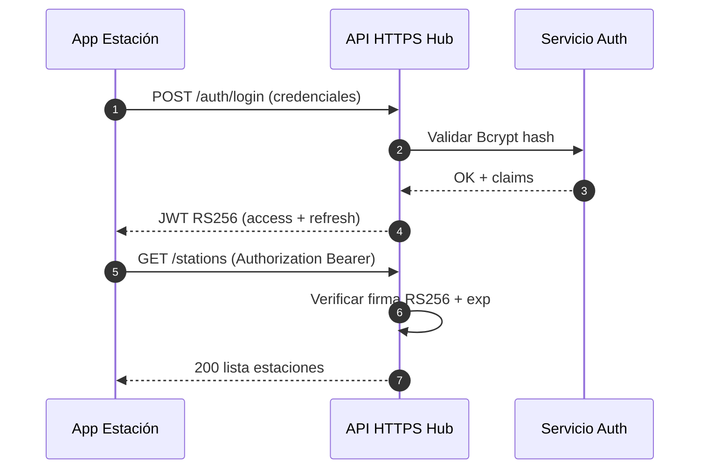

**Recomendaciones operativas inmediatas (sin JWT aún):**

1. Rotar contraseñas de estación tras cada sesión de laboratorio.
2. Revocar MAC en coordinador al retirar dispositivo del aula (`AuthorizationManager.revoke`).
3. No exponer hub TCP a Internet; solo VLAN laboratorio.
4. Registrar en bitácora cada autorización manual de MAC desconocida.

### Anexo F — Exportación a PDF

**Opción recomendada (script del proyecto):**

```powershell
cd docs
npm install
npm run pdf
```

Genera `ENTREGA_FINAL_LEONARDO_ARAYA.pdf` usando Chrome/Edge local y `styles/industrial_pdf.css` (Arial 12 pt, A4).

**Alternativa — script PowerShell:**

```powershell
.\docs\export_entrega_pdf.ps1
```

**Alternativa — Markdown Preview Enhanced (Cursor):**

1. Abrir `ENTREGA_FINAL_LEONARDO_ARAYA.md`.
2. `Ctrl+Shift+P` → `Markdown Preview Enhanced: Open Preview`.
3. Clic derecho → **Chrome (Puppeteer) / PDF** → stylesheet `docs/styles/industrial_pdf.css`.

---

*Documento maestro de entrega — Sistema CIM v6.0 — Leonardo Araya Labarca — RUT 21.290.314-0 — Universidad del Biobío — IECI — 31 de mayo de 2026*
