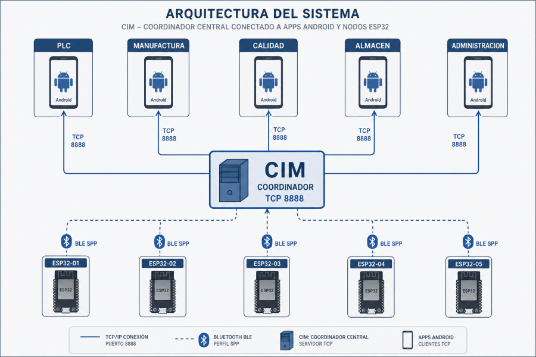
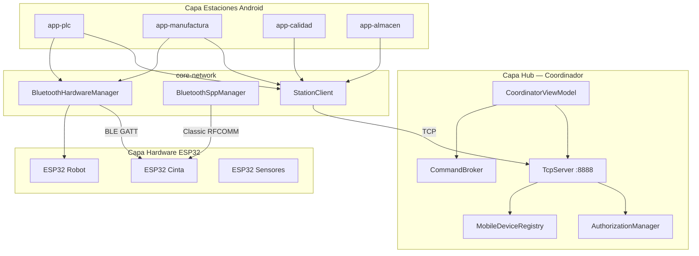
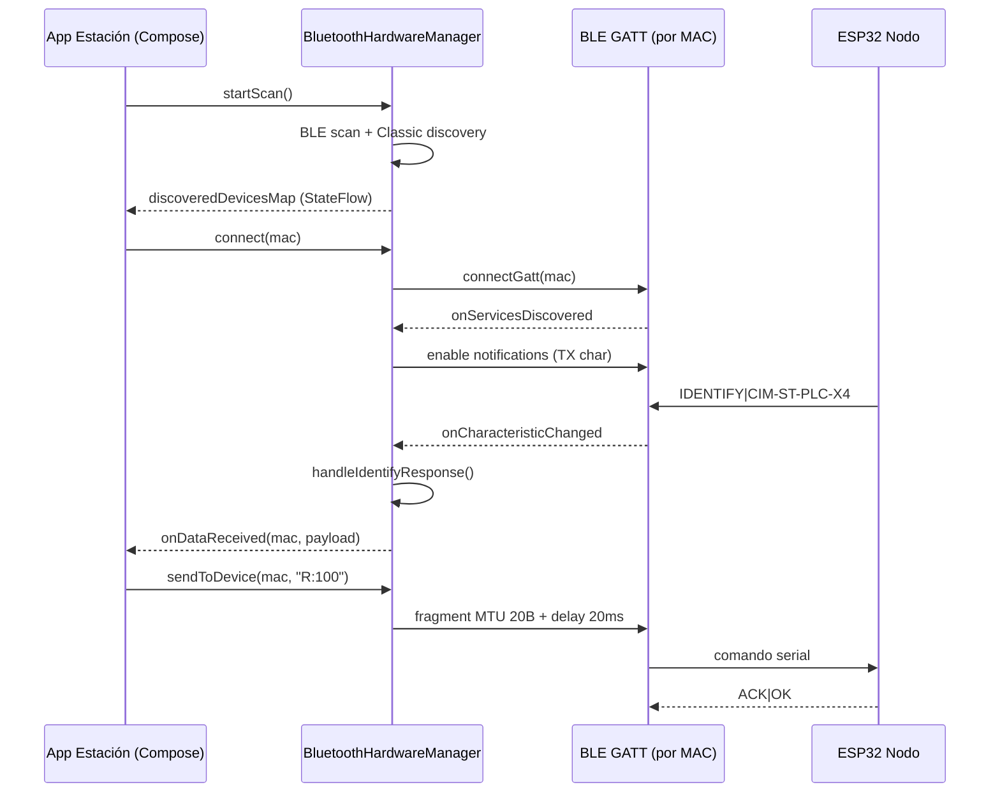
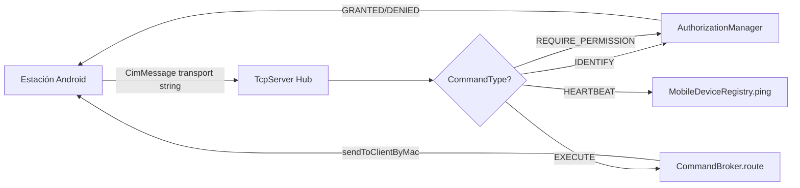
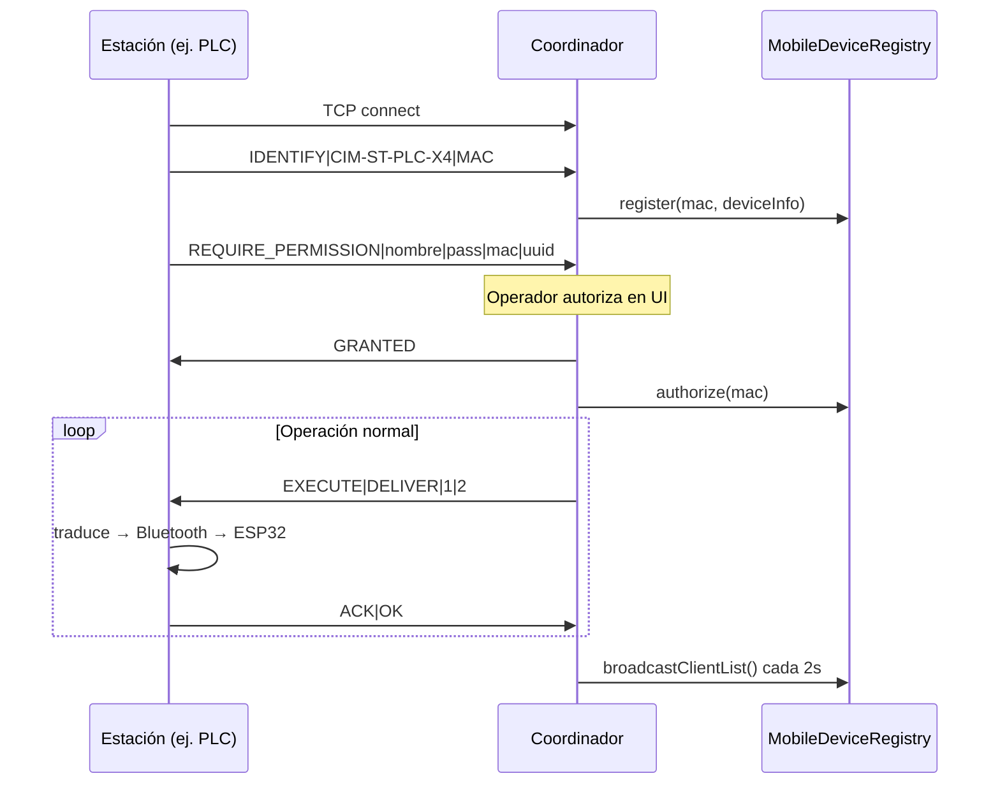

# Guía Profesional CIM v6.0

> **Documento consolidado:** Ver secciones 3 y 6 en [`ENTREGA_FINAL_LEONARDO_ARAYA.md`](ENTREGA_FINAL_LEONARDO_ARAYA.md).

> **Computer Integrated Manufacturing** — Sistema distribuido Android + ESP32  
> Autor del sistema: Practica_2 UBB | Versión **6.0.0**

---

## Tabla de contenidos

1. [Visión general](#1-visión-general)
2. [Arquitectura del sistema](#2-arquitectura-del-sistema)
3. [Flujo Bluetooth multiconexión](#3-flujo-bluetooth-multiconexión)
4. [Protocolo TCP CIM](#4-protocolo-tcp-cim)
5. [Sincronización de estaciones](#5-sincronización-de-estaciones)
6. [Glosario de objetos de referencia](#6-glosario-de-objetos-de-referencia)
7. [Complejidad y rendimiento](#7-complejidad-y-rendimiento)
8. [Despliegue rápido](#8-despliegue-rápido)

---

## 1. Visión general

El ecosistema CIM v6.0 implementa una **línea de producción virtual** con cinco aplicaciones Android y nodos ESP32. El **Coordinador (Hub)** centraliza autorización, enrutamiento de comandos y visibilidad de la malla.



### Principios de diseño

| Principio | Implementación |
|-----------|----------------|
| **Hub-and-Spoke** | Coordinador TCP:8888 + estaciones cliente |
| **Separación de capas** | Apps → `core-network` → firmware |
| **Fail-safe BT** | BLE primario, SPP Classic como fallback |
| **Autorización explícita** | MAC + handshake antes de ejecutar |
| **O(1) en hot paths** | `ConcurrentHashMap` por MAC/IP |

Manuales detallados: [docs/manuals/](manuals/)

---

## 2. Arquitectura del sistema



### Módulos Gradle

```
Practica_2/
├── core-network/          # Librería compartida (TCP, BT, protocolo, visión)
├── app-coordinador/       # Hub central
├── app-plc/               # Cinta transportadora
├── app-manufactura/       # Robot + láser
├── app-calidad/           # ArUco / tracking
├── app-almacen/           # Grid de almacenamiento
└── firmware/Firmware_Support/  # ESP32 PlatformIO
```

---

## 3. Flujo Bluetooth multiconexión



### Estados de conexión

```
┌─────────────┐    scan     ┌──────────────┐   connect   ┌─────────────┐
│  IDLE       │ ──────────► │  DISCOVERED  │ ──────────► │  CONNECTING │
└─────────────┘             └──────────────┘             └──────┬──────┘
                                                                │
                    ┌───────────────────────────────────────────┘
                    ▼
             ┌─────────────┐   disconnect   ┌─────────────┐
             │  CONNECTED  │ ◄────────────► │  RECONNECT  │
             │ (por MAC)   │   backoff exp  │  1s → 30s   │
             └─────────────┘                └─────────────┘
```

**Multiconexión:** cada MAC mantiene su propio `BluetoothGatt` en `ConcurrentHashMap<String, BluetoothGatt>`. La UI observa `connectionStates: StateFlow<Map<String, Boolean>>`.

---

## 4. Protocolo TCP CIM



### Formato de mensaje (transporte)

```
CIM|id|srcMac|srcApp|destMac|destApp|cmdType|priority|sessionId|payload
```

- **Escapado:** `\|` → `\|`, `\n` → `\n` en payload
- **Puerto hub:** `8888` (configurable en coordinador)
- **Lookup cliente:** `macToConnId[mac]` → socket (**O(1)**)

Comandos industriales ESP32 (serial): `R:`, `L:`, `C:`, `STO:`, `CAM:` — ver [02_PROTOCOLO_COMUNICACION_CIM.md](manuals/02_PROTOCOLO_COMUNICACION_CIM.md).

---

## 5. Sincronización de estaciones



### Modo demo (sin hardware)

Los botones **"Simular *"** registran comandos en el terminal local de cada app. Útil para demos académicas y tests de UI.

---

## 6. Glosario de objetos de referencia

| Objeto | Paquete | Responsabilidad |
|--------|---------|-----------------|
| `CimMessage` | `protocol` | DTO del mensaje CIM; serialización transport |
| `CommandBroker` | `network` | Enrutamiento central; log de comandos |
| `TcpServer` | `network` | Servidor hub; mapa MAC→socket |
| `StationClient` | `network` | Cliente TCP de estaciones |
| `BluetoothHardwareManager` | `network` | BLE multiconexión + escaneo híbrido |
| `BluetoothSppManager` | `network` | Fallback Classic RFCOMM |
| `AuthorizationManager` | `network` | Estado AUTH por MAC |
| `MobileDeviceRegistry` | `network` | Registro O(1) dispositivos móviles |
| `DeviceRegistry` | `network` | Registro legacy por IP (ESP32 WiFi) |
| `DiscoveredBluetoothDevice` | `network` | DTO escaneo BT |
| `PermissionManager` | `network` | Permisos Android runtime |
| `CoordinatorViewModel` | `app-coordinador` | Estado UI del hub |

### Tipos de app (`AppType`)

`COORDINADOR`, `PLC`, `MANUFACTURA`, `CALIDAD`, `ALMACEN`, `UNKNOWN`

### Tipos de comando (`CommandType`)

`IDENTIFY`, `IDENTIFIED`, `EXECUTE`, `ACK`, `ERROR`, `HEARTBEAT`, `REQUIRE_PERMISSION`, `START_SEQUENCE`, `STOP_SEQUENCE`, `STATUS_RESPONSE`, `TIMEOUT`

---

## 7. Complejidad y rendimiento

Ver auditoría completa en [TEST_MATRIX.md](TEST_MATRIX.md#auditoría-de-complejidad-temporal-o1).

```
Operación                          │ Estructura              │ Big-O
───────────────────────────────────┼─────────────────────────┼──────
getDeviceByMac(mac)                │ ConcurrentHashMap       │ O(1)
isAuthorized(mac)                  │ ConcurrentHashMap       │ O(1)
sendToClientByMac(mac)             │ macToConnId             │ O(1)
sendToDevice(mac, cmd)             │ connectedDevices        │ O(1)
getDevicesByType(type)             │ índice + k lookups      │ O(k)
send(cmd) legacy single-target     │ keys.firstOrNull        │ O(n) ⚠
```

---

## 8. Despliegue rápido

```powershell
# 1. Compilar y testear
.\gradlew testAllModules buildAllApks

# 2. Flashear ESP32
.\scripts\hardware-testing\flash_and_monitor_esp32.ps1

# 3. Instalar APKs
adb install -r output-apks\app-coordinador.apk
# ... resto de estaciones

# 4. En coordinador: iniciar Servidor Hub (TCP:8888)
# 5. Autorizar estaciones desde UI
```

---

## Documentación relacionada

| Documento | Contenido |
|-----------|-----------|
| [01_ARQUITECTURA_SISTEMA.md](manuals/01_ARQUITECTURA_SISTEMA.md) | Capas y componentes |
| [02_PROTOCOLO_COMUNICACION_CIM.md](manuals/02_PROTOCOLO_COMUNICACION_CIM.md) | Formato mensajes |
| [03_MOTOR_BLUETOOTH_HIBRIDO.md](manuals/03_MOTOR_BLUETOOTH_HIBRIDO.md) | BLE + SPP |
| [TEST_MATRIX.md](TEST_MATRIX.md) | 30 tests + O(1) audit |
| [EXTENSIONS_AND_TOOLING.md](EXTENSIONS_AND_TOOLING.md) | Entorno Cursor |
| [ESP32_SIMULACION_Y_HARDWARE.md](ESP32_SIMULACION_Y_HARDWARE.md) | Simulación y flash |
| [CHANGELOG_FIXES.md](../CHANGELOG_FIXES.md) | Historial de correcciones |

---

*CIM v6.0 — Documentación de entrega profesional. Espressif-style technical documentation.*
