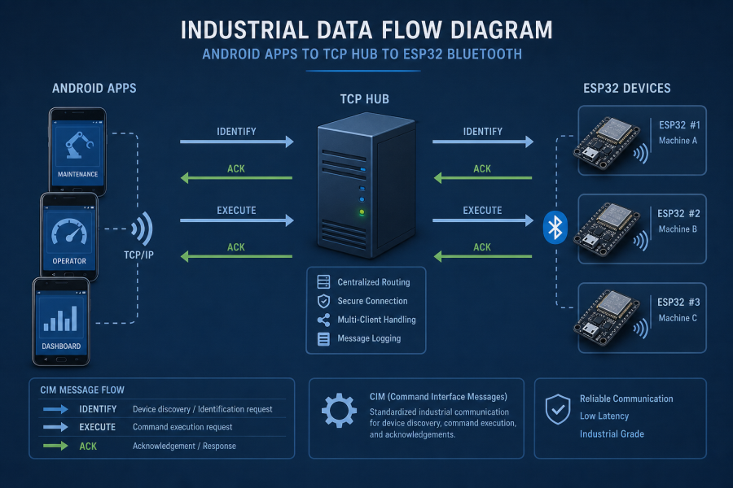
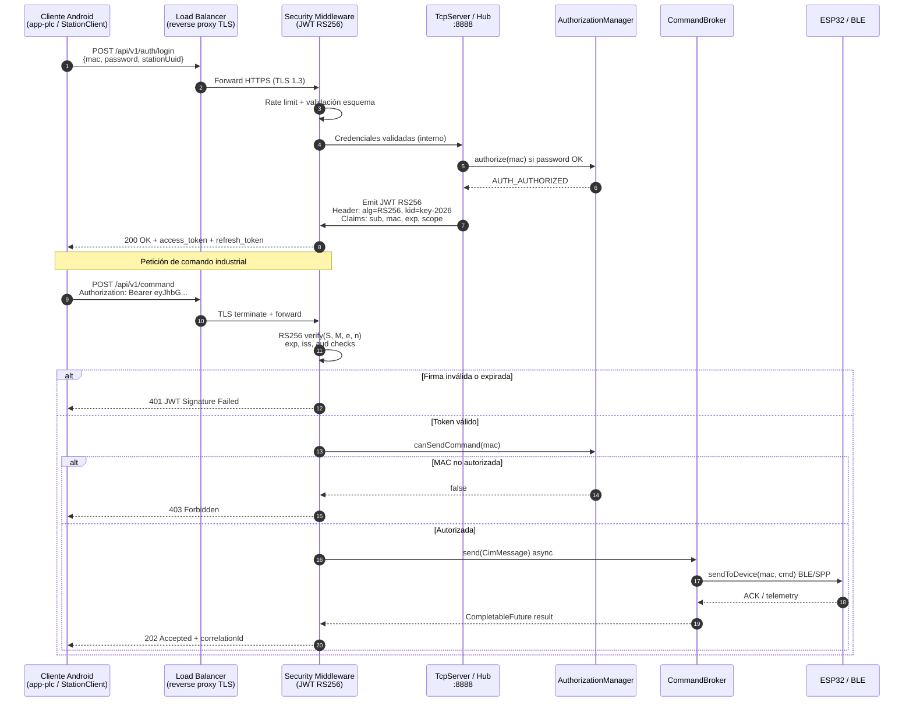
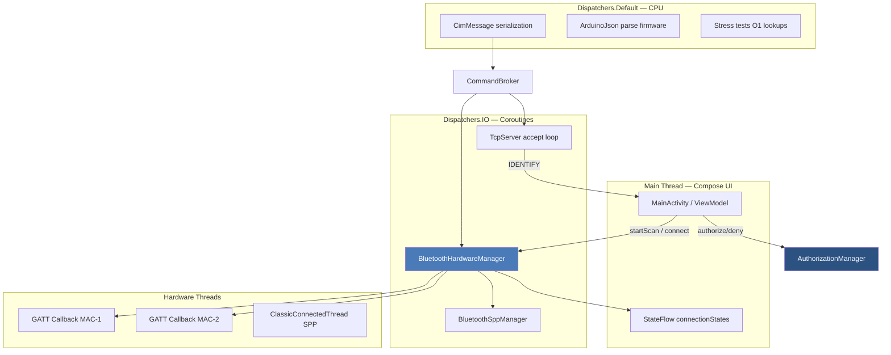
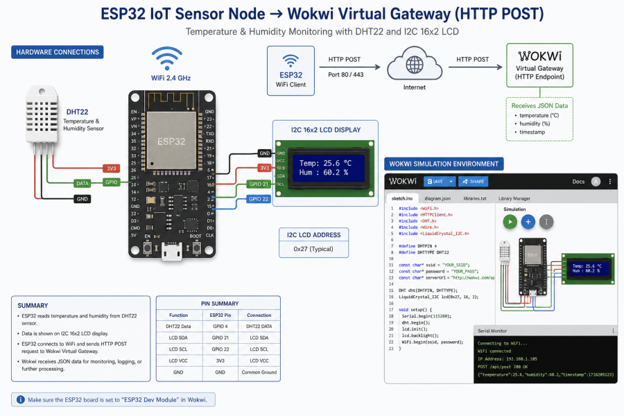

# Manual Industrial de Seguridad — CIM v6.0

> **Documento consolidado:** Ver sección 15 en [`ENTREGA_FINAL_LEONARDO_ARAYA.md`](ENTREGA_FINAL_LEONARDO_ARAYA.md).

> **Alcance:** Practica_2 — Computer Integrated Manufacturing  
> **Clasificación:** Documento técnico interno | **Revisión:** 2026-05-31

---

## 1. Introducción y arquitectura de seguridad industrial

### 1.1 Propósito

Este manual consolida los fundamentos criptográficos, los flujos de autenticación y las prácticas de endurecimiento aplicables al ecosistema **CIM v6.0**: cinco aplicaciones Android (`app-coordinador`, `app-plc`, `app-manufactura`, `app-calidad`, `app-almacen`), la librería compartida `core-network` y firmware ESP32 en `firmware/Firmware_Support`.

La seguridad del proyecto combina:

- **Autorización por MAC** centralizada en `AuthorizationManager` (`ConcurrentHashMap<String, String>`).
- **Handshake TCP** en puerto **8888** vía `TcpServer` con mensajes `IDENTIFY` / permisos.
- **Emparejamiento Bluetooth** híbrido BLE + SPP Classic en `BluetoothHardwareManager`.
- **Contraseñas de estación** en `StationClient` para validación contra el hub.



*Figura 1 — Flujo distribuido: hub TCP, estaciones Android y nodos ESP32.*

Referencia arquitectónica adicional: `docs/GUIA_PROFESIONAL_CIM.md` e imagen `docs/images/cim_arquitectura_v6.png` (si disponible en el workspace).

### 1.2 Versionado y trazabilidad

| Elemento | Versión | Ubicación |
|----------|---------|-----------|
| Firmware ESP32 | 6.0 | `firmware/Firmware_Support/src/main.ino` |
| Protocolo CIM | v6 | `core-network/.../protocol/CimProtocol.kt` |
| Bluetooth Manager | v6.0 | `BluetoothHardwareManager.kt` |
| Matriz de tests | 30 casos PASS | `docs/TEST_MATRIX.md` |
| Changelog | 2026-05-31 | `CHANGELOG_FIXES.md` |

### 1.3 Alcance normativo

El diseño se alinea con recomendaciones **ISO/IEC 27001** (gestión de accesos, segregación de funciones) y **OWASP Mobile / API Security** (validación de identidad, no confiar en clientes no autorizados, rate limiting conceptual en hub).

---

## 2. Fundamentos matemáticos de seguridad

### 2.A Bcrypt — Eksblowfish y factor de coste

**Bcrypt** (Provos & Mazières, 1999) deriva claves mediante **Eksblowfish** (*expensive key schedule Blowfish*): un cifrado simétrico de 64 bits con tabla S dependiente de la clave, iterada con un **cost factor** $c$.

El tiempo de hash escala exponencialmente:

$$T(c) = t_0 \cdot 2^c$$

donde $t_0$ es el tiempo base de una ronda Eksblowfish en el hardware de referencia y $c \in [4, 31]$ es el **work factor** almacenado en el prefijo del hash (`$2a$`, `$2b$`, `$2y$`).

Propiedades relevantes para CIM:

1. **Sal aleatoria** de 128 bits por credencial → defensa contra tablas arcoíris.
2. **Coste ajustable** → mitigación de fuerza bruta cuando se almacenan contraseñas de estación en backend futuro.
3. **Resistencia ASIC/GPU**: memoria accedida de forma pseudo-aleatoria en Eksblowfish limita paralelización masiva frente a SHA-256 simple.

En el proyecto actual, `StationClient` transmite `password` en el payload de permiso (`CimMessage` con `stationName|password|sourceMac|stationUuid`). Para despliegue productivo se recomienda:

- Nunca persistir contraseñas en texto plano en dispositivos compartidos.
- Sustituir comparación directa por verificación Bcrypt en servidor (`password_verify` equivalente) antes de invocar `AuthorizationManager.authorize(mac)`.

Ejemplo de complejidad: con $c=12$, $T(12) = t_0 \cdot 4096$; incrementar $c$ en 1 duplica el coste de ataque offline.

### 2.B RS256 — RSA con SHA-256 (JWT)

**RS256** firma tokens JWT con clave privada RSA y verifica con clave pública. Base matemática:

1. Generación de par de claves: elegir primos grandes $p$, $q$; calcular $n = p \cdot q$.
2. Función de Euler: $\phi(n) = (p-1)(q-1)$.
3. Exponente público $e$ (típicamente 65537) coprimo con $\phi(n)$.
4. Exponente privado $d$ tal que:

$$e \cdot d \equiv 1 \pmod{\phi(n)}$$

**Firma** del mensaje representativo $M$ (hash SHA-256 del payload JWT):

$$S \equiv M^d \pmod{n}$$

**Verificación**:

$$M \equiv S^e \pmod{n}$$

La seguridad reduce a la **dificultad de factorizar** $n$ (problema de factorización de enteros compuestos). Claves ≥ 2048 bits son estándar industrial; 4096 bits para sistemas de larga vida útil.

**Relación con CIM:** aunque el protocolo CIM v6.0 usa MAC + contraseña + estados `AUTH_PENDING` / `AUTH_AUTHORIZED` / `AUTH_BLOCKED`, la capa de middleware HTTP/HTTPS futura (API REST del coordinador) debe adoptar JWT RS256 para:

- Delegar autenticación sin compartir secreto simétrico entre estaciones.
- Permitir rotación de claves (`kid` en header JWT).
- Auditar claims (`sub`, `mac`, `stationType`, `exp`).

---

## 3. Diagramas de secuencia y arquitectura

### 3.A Secuencia JWT HTTP/HTTPS — Cliente móvil CIM



### 3.B Arquitectura multitarea asíncrona — Distribución de hilos CPU



**Implementación real en código:**

- `BluetoothHardwareManager` usa `CoroutineScope(Dispatchers.IO + SupervisorJob())` para reconexión con backoff exponencial (1 s → 30 s máx.).
- `connectedDevices: ConcurrentHashMap<String, BluetoothGatt>` permite **O(1)** en `sendToDevice(mac, cmd)`.
- Fragmentación BLE: paquetes de **20 bytes** con delay **20 ms** entre chunks (MTU conservador).



*Figura 2 — Entorno simulado: sensores, display I2C y POST WiFi virtual.*

---

## 4. Mapeo seguridad ↔ componentes CIM

### 4.1 AuthorizationManager

```kotlin
// core-network/.../AuthorizationManager.kt
object AuthorizationManager {
    private val authorizationStates = ConcurrentHashMap<String, String>()
    fun isAuthorized(mac: String): Boolean =
        getAuthorizationState(mac) == CimProtocol.AUTH_AUTHORIZED
    fun canSendCommand(mac: String): Boolean = isAuthorized(mac)
}
```

Estados: `AUTH_PENDING` (default), `AUTH_AUTHORIZED`, `AUTH_BLOCKED`. El coordinador invoca `authorize(mac)` / `deny(mac)` desde UI; `TcpServer` revoca al desconectar (`AuthorizationManager.revoke(mac)`).

### 4.2 Autenticación TCP (puerto 8888)

`TcpServer` parsea mensajes con tokens delimitados (`;`) para extraer `stationName` y `mac`, registrando la estación antes de permitir comandos. `StationClient` mantiene `authorizationState` local sincronizado con respuestas del hub.

### 4.3 Bluetooth — emparejamiento e IDENTIFY

Al conectar GATT o SPP, el firmware y el manager intercambian `IDENTIFY|APP_ID|MAC|VERSION`. `BleIdentificationHelper` fuerza el handshake BLE. Sin autorización MAC, los botones de hardware en UI permanecen deshabilitados (`!isConnectedBt || !isAuthorized`).

---

## 5. Análisis científico de extensiones del entorno

### 5.1 Markdown Preview Enhanced (MPE)

**ID:** `shd101wyy.markdown-preview-enhanced`

MPE extiende el pipeline Markdown → HTML con:

- Motor **KaTeX/MathJax** para LaTeX inline y display (este manual).
- Renderizado **Mermaid** vía WebView Chromium embebido.
- Exportación **Puppeteer/Chrome Headless** con CSS Paged Media (`docs/styles/industrial_pdf.css`).
- Soporte **PlantUML**, **WaveDrom** y inclusiones de código ejecutable.

Ventaja industrial: un único fuente `.md` genera PDF auditables con numeración de página vía `@page` y contadores CSS.

### 5.2 Markdown All in One — AST y transformaciones

**ID:** `yzhang.markdown-all-in-one`

Opera sobre el **Abstract Syntax Tree** de Markdown (compatibilidad CommonMark/GFM):

- **Table of Contents**: recorre nodos `heading` y genera anclas deterministas.
- **List editing**: renumera listas ordenadas preservando indentación AST.
- **Keyboard shortcuts**: toggle bold/italic sobre rangos de nodos `text`.
- **Math**: delimitadores `$...$` mapeados a nodos math inline en preview.

En CIM, se usa para mantener `docs/TEST_MATRIX.md`, `CHANGELOG_FIXES.md` y este manual con TOC sincronizado.

### 5.3 Paste Image (alternativa instalada)

**ID solicitado:** `mushanshitiancai.paste-image` — **no disponible** en marketplace Cursor.

**Alternativa activa:** `telesoho.vscode-markdown-paste-image`

Flujo: captura del portapapeles → codificación Base64 o archivo en `docs/assets/imagenes/` → inserción de sintaxis `` en cursor. Crítico para evidencias de campo (capturas de `adb logcat`, pantallas de autorización).

### 5.4 Draw.io Integration — iframe embebido

**ID:** `hediet.vscode-drawio`

Abre diagramas `.drawio` / `.dio` en **iframe sandbox** con la aplicación draw.io. Los XML se versionan en Git (`docs/assets/diagramas/`). Ventaja frente a Mermaid: edición WYSIWYG para diagramas eléctricos PLC y topología de planta.

### 5.5 Marp, Markdown PDF, Biome, Prettier

| Extensión | Aplicación CIM |
|-----------|----------------|
| `marp-team.marp-vscode` | Presentaciones de defensa de tesis / demo profesor |
| `yzane.markdown-pdf` | Exportación PDF rápida con hoja industrial |
| `biomejs.biome` + `esbenp.prettier-vscode` | Formateo JSON de `diagram.json`, configs Wokwi |

### 5.6 IoT — Wokwi y PlatformIO

| Extensión | Estado | Uso |
|-----------|--------|-----|
| `wokwi.wokwi-vscode` | ✅ Instalada | Simulación `simulacion_esp32/` |
| `platformio.platformio-ide` | ❌ No en Cursor | **PlatformIO Core CLI** (`pio run`) |
| `jamesfenn.android-adb` | ❌ No encontrada | **`adelphes.android-dev-ext`** + script `deploy_multitask.ps1` |

---

## 6. Matriz de troubleshooting

| Síntoma | Causa probable | Verificación | Acción correctiva |
|---------|----------------|--------------|-------------------|
| **JWT Signature Failed** | Clave pública desactualizada (`kid` rotado), payload alterado, algoritmo distinto de RS256 | Decodificar header JWT (base64url); comparar `kid` con JWKS del hub; revisar reloj NTP del dispositivo (`exp`) | Sincronizar hora; descargar JWKS actual; rechazar tokens `alg=none`; rotar par RSA en servidor |
| **Bcrypt Thread Pool Exhaustion** | Demasiadas verificaciones concurrentes en login (cost $c$ alto) | Monitor CPU; thread dump en middleware; latencia p95 en `/auth/login` | Limitar concurrencia con semáforo; reducir $c$ en entorno dev; cola async para verify; cache negativo por IP |
| **PDF Mermaid no renderiza** | MPE/Puppeteer sin Chromium, Mermaid no ejecutado pre-export, bloque sin fence | Preview MPE en VS Code; consola Puppeteer; validar sintaxis en [mermaid.live](https://mermaid.live) | Actualizar MPE; `mermaid-cli` pre-render a PNG en `docs/assets/diagramas/`; usar `print_background: true` |
| **AUTH_BLOCKED tras IDENTIFY** | Coordinador denegó MAC; password incorrecto en `StationClient` | Log `TcpServer`; estado en `AuthorizationManager.getAuthorizationState(mac)` | Re-autorizar desde UI coordinador; verificar payload PERMISSION |
| **BLE multiconexión falla** | Uso de `send(cmd)` legacy O(n) en lugar de `sendToDevice` | Log fragmentación MTU; mapa `connectedDevices` | Migrar a API v6.0; revisar `BluetoothHardwareManager.kt` |
| **TCP 8888 connection refused** | Hub no iniciado en coordinador | `netstat -an \| findstr 8888` | Iniciar **Servidor Hub** en `MainActivity` coordinador |

---

## 7. Conclusiones

1. **Robustez matemática:** Bcrypt proporciona coste adaptativo contra offline cracking; RS256 habilita confianza asimétrica escalable para capas HTTP futuras sin comprometer el modelo MAC actual.
2. **Coherencia CIM v6.0:** `AuthorizationManager`, `TcpServer` y `BluetoothHardwareManager` implementan defensa en profundidad — ningún comando actuador debe ejecutarse sin `canSendCommand(mac) == true`.
3. **Cumplimiento:** Aplicar controles ISO 27001 A.9 (gestión de accesos) y OWASP M1/M3 (almacenamiento seguro y comunicación) en roadmap productivo.
4. **Verificación:** 30 tests PASS (`docs/TEST_MATRIX.md`) incluyen stress de auth denial (`CimStressAndAcceptanceTest.unauthorizedCommand_blockedByAuthManager`).

---

## Referencias

- Provos, N., & Mazières, D. (1999). *A Future-Adaptable Password Scheme.* USENIX.
- RFC 7519 — JSON Web Token (JWT).
- RFC 7517 — JSON Web Key (JWK).
- OWASP Mobile Application Security Verification Standard (MASVS).
- Documentación interna: `CHANGELOG_FIXES.md`, `docs/GUIA_PROFESIONAL_CIM.md`, `docs/ESP32_SIMULACION_Y_HARDWARE.md`.

---

*Fin del manual — CIM v6.0 — Revisión 2026-05-31*
